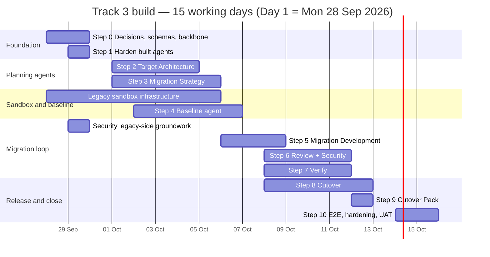

# Track 3 — Code Modernization: Development Plan

**SDLC Platform · Agent-by-agent build plan, effort, testing and a 15-day schedule**

| | |
|---|---|
| Version | 2.2 · 2026-09-28 (adds §24 lessons applied, §25 frontend lane, §26 retrofit of agents 1–2) |
| Branch read | `akshat_main` |
| Companion documents | `Track-3 Flow document.md` (what each agent does), `track3-research.md` (design and system prompts, §5–§7, §12), `Track-3 Lessons from Track 1-2.md` (rules R1–R57 cited in section 24), `Track-3 Implementation Prompt.md` (the build prompt) |
| Scope | Everything needed to take Track 3 from **2 built agents** to **10 production-ready agents**: shared backbone, legacy sandbox, eight agents, frontend pages, testing and customer acceptance |
| Duration | **15 working days** (Day 1 – Day 15) |

> **How to read the numbers.** Time is counted in **working days** (Day 1 = the first day of the
> build). Effort is counted in **engineer-days (ed)**: one engineer working one day. Every
> estimate assumes AI-assisted development at the pace the team already achieved in Phase 1
> (section 2).

---

## Contents

1. [Summary](#1-summary)
2. [The pace this plan is based on](#2-the-pace-this-plan-is-based-on)
3. [How AI assistance is used](#3-how-ai-assistance-is-used)
4. [Team](#4-team)
5. [How 15 days is achieved: contract-first parallel build](#5-how-15-days-is-achieved-contract-first-parallel-build)
6. [Build order and day plan](#6-build-order-and-day-plan)
7. [The standard checklist every agent must complete](#7-the-standard-checklist-every-agent-must-complete)
8. [Step 0 — Decisions, hand-over schemas and shared backbone (Days 1–3)](#8-step-0--decisions-hand-over-schemas-and-shared-backbone-days-13)
9. [Step 1 — Hardening the two built agents (Days 2–3)](#9-step-1--hardening-the-two-built-agents-days-23)
10. [Step 2 — Target Architecture (Days 4–6)](#10-step-2--target-architecture-days-46)
11. [Step 3 — Migration Strategy (Days 4–7)](#11-step-3--migration-strategy-days-47)
12. [Step 4 — Legacy sandbox and Equivalence Testing, Baseline mode (Days 1–8)](#12-step-4--legacy-sandbox-and-equivalence-testing-baseline-mode-days-18)
13. [Step 5 — Migration Development (Days 7–10)](#13-step-5--migration-development-days-710)
14. [Step 6 — Migration Review and Security (Days 2–11)](#14-step-6--migration-review-and-security-days-211)
15. [Step 7 — Equivalence Testing, Verify mode (Days 9–11)](#15-step-7--equivalence-testing-verify-mode-days-911)
16. [Step 8 — Cutover (Days 9–12)](#16-step-8--cutover-days-912)
17. [Step 9 — Cutover Pack (Days 11–12)](#17-step-9--cutover-pack-days-1112)
18. [Step 10 — End-to-end integration, hardening and acceptance (Days 13–15)](#18-step-10--end-to-end-integration-hardening-and-acceptance-days-1315)
19. [Testing strategy](#19-testing-strategy)
20. [Total effort and schedule](#20-total-effort-and-schedule)
21. [Milestones and demos](#21-milestones-and-demos)
22. [Risks and how the plan handles them](#22-risks-and-how-the-plan-handles-them)
23. [What is needed from people outside the team, by day](#23-what-is-needed-from-people-outside-the-team-by-day)
24. [Lessons from Track 1/2 applied to this plan](#24-lessons-from-track-12-applied-to-this-plan)
25. [The frontend lane: built in parallel, one bespoke UI per agent](#25-the-frontend-lane-built-in-parallel-one-bespoke-ui-per-agent)
26. [Step 1 expanded: retrofitting Migration Intent and Dependency and Risk](#26-step-1-expanded-retrofitting-migration-intent-and-dependency-and-risk)

---

## 1. Summary

| # | Step | Days | Engineer-days | Infra-days | Built by |
|---|---|---|---|---|---|
| 0 | Decisions, hand-over schemas, shared backbone (ledger, envelope, target repo, restore, fallback approval, Programme page) | 1–3 | 8 | — | E1, E2, E3, E4 |
| 1 | Hardening Migration Intent and Dependency and Risk | 2–3 | 2 | — | E3 |
| 2 | Target Architecture | 4–6 | 6 | — | E2, E3 |
| 3 | Migration Strategy | 4–7 | 5 | — | E1, E3 |
| 4 | Legacy sandbox + Equivalence Testing (Baseline) | 1–8 | 14 | 7 | E5, E4, E1, E3 + Infra |
| 5 | Migration Development | 7–10 | 6 | 2 | E2, E4 + Infra |
| 6 | Migration Review + Security | 2–11 | 6 | — | E3, E4 |
| 7 | Equivalence Testing (Verify) | 9–11 | 4 | 2 | E5, E4 + Infra |
| 8 | Cutover | 9–12 | 6 | 1 | E1, E4, E5 + Infra |
| 9 | Cutover Pack | 11–12 | 3 | — | E2, E3 |
| 10 | End-to-end integration, hardening, security review, customer acceptance | 13–15 | 15 | 3 | Whole team |
| | **Total** | **15 days** | **75 ed** | **15** | 5 engineers + 1 infrastructure engineer + QA |

**Headline:** the eight remaining agents, the shared backbone and the legacy sandbox are built
in **15 working days** by **five full-stack engineers, one infrastructure engineer and one QA
engineer**, with security review and product-owner decisions on fixed days. That is **75
engineer-days** plus **15 infrastructure-days** and **15 QA-days**.

**Illustrative calendar:** Day 1 = **Monday 28 September 2026**, Day 15 = **Friday 16 October
2026**.

**The first thing to start is the legacy runtime sandbox** (Step 4). It gates baseline capture,
verification, the Migration Development's preview and the Cutover parallel run, so it runs from
Day 1 in parallel with everything else and is ready on Day 7.

---

## 2. The pace this plan is based on

### 2.1 What Phase 1 delivered (measured from the repository)

| Item | Measured |
|---|---|
| Backend: `requirements_modernization_agent/` | ≈ 2,280 lines of Python |
| Backend: `discovery_agent/` | ≈ 2,210 lines |
| Backend: `modernization_common/` (legacy-code pull, versions, exports) | ≈ 1,380 lines |
| Frontend: Track 3 pages and components | ≈ 3,450 lines (TS/TSX) |
| Tests | ≈ 2,180 lines, **109 tests** |
| Elapsed time | Research and Phase 0 on 10 Sep 2026; both agents, pages, versions and exports on 11–12 Sep; polish to 16 Sep |
| Team | 3 contributors, AI-assisted |

**Two agents plus their shared code took three people about three days to build and demo.**
(That is a *build-to-demo* figure. Track 1's Development agent, planned and unit-tested, then
needed fifteen more fixes when first used with a real repository, real credentials and a real
browser, and the Orchestrator needed five phases. Section 24 says what this plan therefore
assumes about hardening.)
That is roughly **4–5 engineer-days per agent** including its page and tests. This plan budgets
**3–8 engineer-days per agent** depending on complexity (section 20.1), and adds the backbone,
the sandbox and three days of end-to-end hardening on top.

### 2.2 Track 1 code reused (measured size)

Reuse is what keeps each agent inside its days. Every step names what it takes from Track 1.

| Track 1 package | Lines | Reused by |
|---|---|---|
| `design_architecture_agent/` | ≈ 5,160 | Target Architecture (ADRs, diagram rendering, exports) |
| `pm_agent/` | ≈ 2,250 | Migration Strategy (board writes, calendar helpers) |
| `testing_agent/` incl. `tools/sandbox/docker_runner.py` | ≈ 20,520 | Equivalence Testing (sandbox runner, report plumbing) |
| `development_agent/` (`git_tools.py`, `sandbox_policy.py`, `path_guard.py`) | ≈ 6,440 | Migration Development |
| `code_review_agent/` | ≈ 2,370 | Migration Review |
| `security_agent/` | ≈ 2,310 | Security (whole scan stack) |
| `deployment_agent/` | ≈ 10,150 | Cutover (package, staging, gated pipeline requests) |
| `documentation_agent/` | ≈ 2,040 | Cutover Pack |

---

## 3. How AI assistance is used

AI assistance is used on every step, by every engineer, from Day 1.

| Activity | How AI is used |
|---|---|
| Agent wiring (registry entries, routers, WS/REST handlers, migrations, permissions) | Generated from the Phase 1 agents as templates, then reviewed |
| System prompts | Already drafted in `track3-research.md` §6.3–§6.10; AI adapts them to the final tool names |
| Payload validators and schemas | Generated directly from the JSON payloads specified in the prompts |
| Deterministic tools (interface scanner, wave planner, diff engine, readiness check, traceability map) | AI drafts the algorithm and its tests; the engineer owns the contract and edge cases |
| Frontend pages | Generated from the existing Development, Design and `StageWorkbench` pages and the page specs in `track3-research.md` §7.4 |
| Tests and fixtures | Unit and property tests generated; planted-defect tests written by engineers (section 19.3) |
| Infrastructure as code | Dockerfiles, runner configuration and network policies drafted by AI, applied and verified by the infrastructure engineer |
| Code review | AI first-pass review on every PR, then human review the same day |
| Documentation | Admin guide, role guides and runbooks drafted from the flow document on Day 15 |

**Rules for AI-assisted work on this build**

1. Every AI-generated change is reviewed by an engineer before merge, **on the same day**.
2. Planted-defect tests are written by a person and must be seen failing first.
3. No real customer data is given to an AI assistant; fixtures are ClaimTrack, eShopModernizing
   and synthetic masked data.
4. Prompt changes are checked against recorded conversation fixtures before merge.

---

## 4. Team

| Id | Role | Allocation | Focus |
|---|---|---|---|
| **E1** | Full-stack engineer (backend lead) | 15 days | Ledger, Migration Strategy, Cutover |
| **E2** | Full-stack engineer | 15 days | Target repository, Target Architecture, Migration Development, Cutover Pack |
| **E3** | Full-stack engineer | 15 days | Fallback approval, hardening, Target Architecture, Migration Review |
| **E4** | Full-stack engineer | 15 days | Hand-over schemas, Security, sandbox stubs, Migration Development |
| **E5** | Full-stack engineer | 15 days | Sandbox integration, Equivalence Testing (both modes) |
| **I1** | Infrastructure engineer | 15 days | Registry, legacy and toolchain images, isolation, storage, target sandbox, staging, metrics source |
| **QA** | QA engineer | 15 days | Test plan, fixtures, planted defects, live verification of each step, E2E, UAT script |
| **SEC** | Security engineer | Days 4, 10, 14 | Threat model, mid-build review, final review |
| **PO** | Product owner / architect | Day 1 (decisions), 15 minutes every day, Day 15 (UAT) | Decisions, daily acceptance of completed items |

Daily rhythm: 15-minute stand-up at the start of each day; merges and live verification at the
end of each day; the product owner accepts or rejects each completed item the same day.

---

## 5. How 15 days is achieved: contract-first parallel build

The flow is sequential for a **customer** (each agent needs the previous agent's approved
artifact), but the **build** does not have to be. Three practices make it parallel:

1. **Hand-over schemas on Day 1.** Every hand-over packet in `Track-3 Flow document.md` (brief,
   assessment, design, plan, baselines, migration record, review, security report, equivalence
   results, cutover plan) is frozen as a JSON schema on Day 1, with a **ClaimTrack fixture
   instance** of each. Every agent builds against the fixture of its inputs, so no agent waits
   for the agent before it to be finished.
2. **Backbone first, and small.** The ledger, envelope and target-repository reference are
   delivered by Day 3, so every agent writes the same state from its first line of code.
3. **Sandbox from Day 1.** The one piece of real infrastructure starts on Day 1 and is ready on
   Day 7, before the first agent needs it.

Integration happens continuously: when an agent is finished it replaces its fixture with real
output, and the next agent's live verification runs on real data from that day on. Days 13–15
run the whole chain end to end.

---

## 6. Build order and day plan

### 6.1 Order

| Order | Step | Why it is here |
|---|---|---|
| 0 | Decisions, schemas, backbone | Every agent reads and writes the ledger, the envelope and the schemas |
| 1 | Harden built agents | Later agents need `M-xx` ids, `must_not_change` and typed success measures |
| 2 | Target Architecture | Its approval creates the ledger rows; its contracts and traps feed everything after it |
| 3 | Migration Strategy | Produces the equivalence criteria and the baseline plan |
| 4 | Legacy sandbox + Baseline | Moved ahead of the Migration Development agent (per `track3-research.md` §7.6): nothing can be proven without a baseline, and the sandbox is the one real infrastructure item |
| 5 | Migration Development | Needs the plan, the baseline and the harness |
| 6 | Review + Security | Run on the Migration Development agent's PR; Security's legacy-side work starts early because it does not need a PR |
| 7 | Verify | Reuses the Baseline harness on a reviewed PR |
| 8 | Cutover | Aggregates every gate |
| 9 | Cutover Pack | Compiles evidence from every agent |
| 10 | End to end | Proves the chain on ClaimTrack and eShopModernizing |

The registry rule still holds: an agent id joins `TRACK_PORTFOLIOS["modernization"]` only after
its `AgentCapability` is registered and it runs end to end (the Phase 0 build-order guard
enforces this).

### 6.2 Day-by-day assignment grid

| Day | E1 | E2 | E3 | E4 | E5 | I1 | QA |
|---|---|---|---|---|---|---|---|
| **1** | Decisions (am); Ledger | Target repo ref | Fallback approval | Decisions (am); Hand-over schemas + fixtures | Sandbox runner integration | Registry; legacy images | Test plan; fixtures |
| **2** | Ledger | Restore + compare | Harden Migration Intent | Security: prompt split, legacy scan cache | Sandbox runner integration | Legacy images | Planted-defect list |
| **3** | Envelope, staleness, ids | Programme page | Harden Dependency and Risk | Security: finding diff, secret, authz | Masked data seeding | Legacy images | Backbone verification |
| **4** | Strategy: wave order | Target Arch: read tools, validator | Target Arch: interface scanner | Sandbox: external-call stubs | Masked data seeding | Network isolation | Hardening verification |
| **5** | Strategy: calendar, effort | Target Arch: prompt, wiring | Target Arch: interface scanner | Sandbox: baseline storage | Baseline: plan_capture | Network isolation | Sandbox isolation tests |
| **6** | Strategy: validator, board | Target Arch: page | Target Arch: tests + live | Baseline: capture twice | Baseline: plan_capture | In-region storage; per-run DB | Target Arch verification |
| **7** | Strategy: wiring + live | Migration Development: workspace, tiers, loop | Strategy: page | Baseline: capture twice | Baseline: record, ledger | In-region storage; per-run DB | Strategy verification |
| **8** | Baseline: tests + live | Migration Development: plan, validator, push | Baseline: page | Migration Development: recipe runner | Baseline: prompt, wiring | Toolchain images | Baseline guarding tests |
| **9** | Cutover: readiness | Migration Development: prompt, page | Review: API-surface diff | Migration Development: preview, budget | Verify: replay | Toolchain images | Migration Development guarding tests |
| **10** | Cutover: plans | Migration Development: tests + live | Review: anti-patterns, validator | Security: policy, page, live | Verify: diff + classify | Target sandbox | Review/Security guarding tests |
| **11** | Cutover: data, steps, decommission | Cutover Pack: traceability map | Review: wiring, page, live | Verify: page, tests, live | Verify: perf, record | Target sandbox | Verify guarding tests |
| **12** | Cutover: sign-off, wiring | Cutover Pack: evidence, docs, PR | Cutover Pack: wiring, page, tests | Cutover: SLO read, page | Cutover: tests, rehearsal prep | Staging; metrics source | Cutover + Pack guarding tests |
| **13** | E2E ClaimTrack | E2E ClaimTrack | E2E ClaimTrack | E2E ClaimTrack | E2E ClaimTrack | E2E support | E2E run |
| **14** | Resilience | eShopModernizing run | Security fixes | Security fixes | Perf and cost | Security review support | E2E defects |
| **15** | Release candidate | Docs | UAT | UAT | UAT | Release support | UAT script, sign-off |

> Calendar mapping: Days 1–5 = 28 Sep – 2 Oct; Days 6–10 = 5 – 9 Oct; Days 11–15 = 12 – 16 Oct.
> The chart shows calendar dates; Saturdays and Sundays inside a bar are not working days.

---

## 7. The standard checklist every agent must complete

The same six-place wiring the two built agents used, plus the enterprise items. It is part of
every step's engineer-days.

**Backend**
- [ ] Package `backend/agents_orchestrator/<name>_agent/` with `agents/` (LangGraph `app`),
      `prompts/` (`*_SYS_MESSAGE` + `MCP_TOOLS_PROMPT_NOTE`), `tools/`, `config/session_state.py`
      and `<name>_agent_api.py` (standalone WS + REST).
- [ ] `config/agent_registry.py`: `AGENT_REGISTRY` entry (`input_artifacts`, `output_artifact`,
      `route_path`, `gate_type`), `_OWNER_OF` entry (the Project Admin then gets owner reach
      automatically), then `TRACK_PORTFOLIOS["modernization"]`.
- [ ] `orchestrator2/registry.py` capability; `router.py` `DISPLAY_NAMES`, `_CAPABILITIES`,
      `_ALIASES`, `_MODERNIZATION_ROSTER`.
- [ ] Standalone handler calls `assert_agent_access_for_chat_on_track`; router mounted in
      `process_api.py`.
- [ ] Alembic migration: new `runs.<artifact>` JSONB column, deliverables CHECK widened, the
      agent's approve permission (check `alembic heads` before numbering).
- [ ] Versions and exports through `modernization_common/versions.py`; `restore_version` tool.
- [ ] Traces on the Langfuse path, tagged with project, module and wave.

**Frontend**
- [ ] Page under `app/(app)/projects/[id]/<route>/` with the agent's bespoke panel.
- [ ] `agentWsPath` case in `app/api/chat/route.ts` + pinned case in `chat-agent-map.test.ts`.
- [ ] `lib/roles.ts` ownership (pinned by `tests/test_agent_reach_matches_frontend.py`).
- [ ] `lib/tracks.ts` id; `lib/agents.ts` label, description, `GATE_POLICY`; `BUILT_AGENTS` only
      when backend and page are both real.

**Tests and evidence**
- [ ] Unit tests for every deterministic tool; a refusal test per validator rule; track-scoping
      test (a Greenfield project cannot reach the agent, including through a forced id); PA
      owner-reach invariant; the step's guarding test (section 19.3).
- [ ] Live verification on the dev stack against ClaimTrack (and eShopModernizing where
      relevant), recorded in the step's handoff note, the same day the step finishes.

---

## 8. Step 0 — Decisions, hand-over schemas and shared backbone (Days 1–3)

**Effort:** 8 ed · **Who:** E1, E2, E3, E4 · **Done by:** end of Day 3

### 8.1 Decisions taken on the morning of Day 1

Open in `track3-research.md` §10 and §12.5. The product owner decides all ten on Day 1; the
recommended answer is the default if no other answer is given by midday.

| # | Decision | Default |
|---|---|---|
| 1 | Display names and `_modernization` id suffix | Adopt |
| 2 | Baseline as a mode of Equivalence Testing | Adopt |
| 3 | Ledger as a table (`modernization_modules`) | Adopt |
| 4 | Legacy sandbox platform | The existing Docker runner (`docker_runner.py`) on the dev host, extended with isolation |
| 5 | Cutover executes steps, or files requests only | Request-only |
| 6 | Per-module token budget in the UI | Yes |
| 7 | PA fallback: always available or after SLA | Always, with `after_sla` as a setting |
| 8 | PA standing in for the business owner | No in Strict; yes in Standard/Pilot |
| 9 | PA reach as a floor | Yes |
| 10 | Minimum two Project Admins per Track 3 project | Yes (warning at setup) |

### 8.2 Work items

| Work item | Detail | Who | Day | ed |
|---|---|---|---|---|
| Hand-over schemas + ClaimTrack fixtures | JSON schema for every hand-over packet and one ClaimTrack fixture instance of each (section 5) | E4 | 1 | 1 |
| Module Migration Ledger | `modernization_modules` table, append-only `history`, DB-level check on allowed transitions, service with per-agent transition permissions | E1 | 1–2 | 2 |
| Envelope, staleness, stable ids | `schema_version`, `built_from`, `produced_by`, status; staleness computation and badge API; id minting (`M-`, `CT-`, `TR-`, `ADR-`, `W-`, `EC-`, `BL-`, `F-`, `S-`, `EQ-`, `CO-`) | E1 | 3 | 1 |
| Target repository reference | `"{agent_id}::connector::{ref}"` with `ref ∈ {legacy, target}`; `get_connector_for_session` honours it; "Target repository" picker in project settings | E2 | 1 | 1 |
| Version restore and compare | `POST …/versions/{v}/restore` (reason required), `restored_from` / `restore_reason` columns, diff endpoint, "Restore" and "Compare" on the version rail | E2 | 2 | 1 |
| Programme page | `/projects/[id]/modernization`: ledger as a board (modules × states, waves, blocked, stale) | E2 | 3 | 1 |
| Universal PA fallback approval | `can_user_approve(user, project, stage)` returning `approved_as`; Track 3 `GATE_OWNER` entries aligned with `_OWNER_OF`; applied in the version gate, approvals router and document-approval tool; `approved_as` + `fallback_reason` columns; fallback-mode setting; SLA escalation job; PA-reach floor; two-PA warning | E3 | 1 | 1 |
| **Total** | | | | **8** |

### 8.3 How to test it

| Test | Proves |
|---|---|
| Every disallowed ledger transition is refused | The state machine is enforced in the DB and service |
| Only the owning agent may make its transitions; concurrent writes (Review + Security) lose nothing | Ownership and concurrency |
| Newer approved input → stale; newer draft → not stale | Staleness rule |
| Restore creates vM and never mutates vN; the restorer cannot approve vM | Reverts keep history and separation of duties |
| PA approves an owner's version (allowed, labelled fallback); PA approves own version (refused); PA fills two slots (refused); Strict refuses PA for the business-owner slot; `after_sla` refuses before the SLA | Fallback rules |
| Every id in `TRACK_PORTFOLIOS["modernization"]` resolves to `owner` for `project_admin` | PA reach invariant |
| A stage wired for `legacy` read cannot obtain a `target` write credential | Least privilege |
| Each fixture validates against its schema | Schemas are usable by every step |

**Done when (Day 3):** all tests pass; the Programme page shows seeded ledger rows; the migration
applies on a fresh DB and on a copy of the dev DB.

---

## 9. Step 1 — Hardening the two built agents (Days 2–3)

**Effort:** 2 ed · **Who:** E3 · **Done by:** end of Day 3

| Work item | Source | Day | ed |
|---|---|---|---|
| Migration Intent: `must_not_change` recorded word for word; `kind` on each success measure (`equivalence | performance | security | schedule | cost`); "after the brief" hand-over paragraph in the prompt; export shows both; envelope fields; `restore_version` tool | research §6.1 | 2 | 1 |
| Dependency and Risk: `M-xx` ids stable within a commit; "Not assessable statically" section; `golden_master` becomes a pointer; `_GOLDEN_MASTER_NOTE` points to Equivalence Testing; hand-over line in the prompt; envelope fields; `restore_version`; live re-verification on ClaimTrack | research §6.2 | 3 | 1 |

**Tests:** the existing 109 tests stay green; new tests for `must_not_change` capture (a vague item
→ the agent asks), `kind` required, `M-xx` stable across two runs on the same commit, the
not-assessable section present for the ClaimTrack batch runtime case.

**Done when (Day 3):** a ClaimTrack brief and assessment carry the new fields and ids, verified
live.

---

## 10. Step 2 — Target Architecture (Days 4–6)

**Id:** `design_modernization` · **Owner role:** Architect · **Effort:** 6 ed · **Who:** E2, E3
**Reuses:** `design_architecture_agent/` (ADRs, Mermaid rendering, .docx/.pdf export),
`discovery_agent/tools/assessment_tools.py`, `modernization_common/legacy_code.py`.

| Work item | Detail | Who | Day | ed |
|---|---|---|---|---|
| `capture_legacy_interfaces` (deterministic) | Scans the checkout for Spring `@RequestMapping` / JAX-RS paths, `web.xml` servlet mappings, JSP routes, outbound HTTP clients, files written/read, scheduled jobs (Quartz/cron), DB tables from DDL and queries | E3 | 4–5 | 2 |
| Read tools + `record_target_design` validator | `read_migration_brief`, `read_assessment` (approved first, else newest draft); refuses a module with no pattern, a pattern outside the vocabulary, a contract with no legacy location, an ADR with < 2 options, an EOL version; creates ledger rows → `designed` on approval | E2 | 4 | 1 |
| Prompt, graph, API, wiring, migration | `DESIGN_MODERNIZATION_SYS_MESSAGE` from research §6.3; `target_design_artifacts`; `approve_target_design` | E2 | 5 | 1 |
| Page `/projects/[id]/target-architecture` | Layers today → target; pattern chips per module; contracts table; ADR list; Mermaid diagrams (Design page renderer); version rail | E2 | 6 | 1 |
| Tests + live verification | Below | E3 | 6 | 1 |
| **Total** | | | | **6** |

### How to test it

| Level | Test |
|---|---|
| **Guarding** | `capture_legacy_interfaces` on the **ClaimTrack** and **eShopModernizing** fixtures returns the known endpoints, files, jobs and tables (golden files) |
| **Guarding** | Validator refusal for each of the five rules; Greenfield project cannot reach the agent |
| Unit | A contract not found in the interface inventory is saved as `proposed`, never `confirmed` |
| Integration | Approval creates one ledger row per in-scope module in `designed`, with `patterns`, `contract_ids`, `adr_ids` |
| Integration | Re-approving the brief marks the design stale |
| Determinism | Same inputs twice → same modules, contracts and patterns |
| Prompt | Recorded conversations: greets and states versions; at most three questions; never shows a tool name; records only after agreement |
| Live | ClaimTrack: patterns for M-01..M-05; `/api/v1`, bank file and CR-4 as contracts; PolicyHub extract proposed; traps include trailing-slash matching, map ordering, Python 3 rounding, MySQL 8 GROUP BY, time zone |

**Done when (Day 6):** an Architect approves a ClaimTrack design on the dev stack and the ledger
is populated.

---

## 11. Step 3 — Migration Strategy (Days 4–7)

**Id:** `strategy` · **Owner role:** Architect · **Effort:** 5 ed · **Who:** E1, E3
**Reuses:** `pm_agent/` board-write and calendar helpers; replaces the existing stub page at
`/projects/[id]/strategy`; `GATE_POLICY.strategy` already exists.

| Work item | Detail | Who | Day | ed |
|---|---|---|---|---|
| `propose_wave_order` (deterministic) | Topological sort of the dependency graph + the design's ordering constraints + risk score; returns order, forcing edges, cycles; property tests | E1 | 4 | 1 |
| `check_calendar`, `estimate_effort` (deterministic) | Milestones, freeze date, cutover windows vs waves, conflicts including inside the brief; effort bands from tier × LOC × pattern, labelled as an estimate | E1 | 5 | 1 |
| Validator, board writes, rule-proposal intake | Every module in exactly one wave; every EC has observable, input set, comparison; every normalization rule has a reason; every wave has a rollback; ledger → `sequenced`; `create_wave_work_items` (Consequential); proposals from Equivalence Testing create a plan revision | E1 | 6 | 1 |
| Prompt, API, wiring, migration + live | `STRATEGY_SYS_MESSAGE` from research §6.4; `strategy_artifacts`; `approve_migration_plan`; live run on ClaimTrack | E1 | 7 | 1 |
| Page | Wave timeline with the brief's milestones overlaid; EC table with normalization rules; conflicts panel | E3 | 7 | 1 |
| **Total** | | | | **5** |

### How to test it

| Level | Test |
|---|---|
| **Guarding** | `propose_wave_order` **never violates a dependency edge** on randomly generated graphs (property test); cycles are reported, never broken silently |
| **Guarding** | Calendar-conflict fixtures: freeze before a baseline due date; hypercare past a lease end; two contradictory deadlines — all reported |
| Unit | Validator refusals for each rule |
| Unit | Derived dates labelled `proposed`; user dates never changed |
| Integration | Approval moves ledger rows to `sequenced` with `wave` and `ec_ids`; board write only after an explicit yes; no board → says so and continues |
| Live | ClaimTrack: foundation plus waves, the SOC 2-driven reorder explained, three calendar conflicts surfaced |

**Done when (Day 7):** a ClaimTrack plan is approved on the dev stack and the ledger shows
`sequenced`.

---

## 12. Step 4 — Legacy sandbox and Equivalence Testing, Baseline mode (Days 1–8)

**Id:** `testing_modernization` · **Owner role:** QA
**Effort:** 14 ed + 7 infra-days · **Who:** E5, E4, E1, E3 + I1
**Reuses:** `testing_agent/tools/sandbox/docker_runner.py`, the Testing agent's report plumbing.

### 12.1 Sandbox (Days 1–7)

| Work item | Detail | Who | Day | ed / infra |
|---|---|---|---|---|
| Private registry + legacy runtime images | One image per legacy runtime (Zulu OpenJDK 7/8, Node 8, Python 2.7, MySQL 5.6), **by digest**. Python 2.7 first (ClaimTrack reports, the first wave) | I1 | 1–3 | 3 infra |
| Network isolation | **No egress** except to a per-run DB container; ephemeral per tenant; destroyed after capture | I1 | 4–5 | 2 infra |
| In-region storage + per-run DB container | Blob storage in the configured region; per-run DB container lifecycle | I1 | 6–7 | 2 infra |
| Runner integration | `docker_runner.py` extended for the legacy images and isolation policy | E5 | 1–2 | 2 |
| Masked data seeding | DB seeded from a masked snapshot; deterministic tokenization so joins still line up | E5 | 3–4 | 2 |
| External-call stubs | Record/replay stubs for outbound services (bank gateway, fraud service); stub catalogue | E4 | 4 | 1 |
| Baseline storage | Hashing, retention setting, `BL-xx` references | E4 | 5 | 1 |

### 12.2 Baseline agent (Days 5–8)

| Work item | Detail | Who | Day | ed |
|---|---|---|---|---|
| `plan_capture` | Baseline plan → scenarios: HTTP (record via proxy), batch (DB snapshot → files/rows), report (snapshot → file), UI (Playwright scripts) | E5 | 5–6 | 2 |
| `capture_baseline` | Runs legacy **twice**; noise report of fields that differ; Consequential | E4 | 6–7 | 2 |
| `record_baseline` + ledger + proposals | Ledger → `baselined`; assessment `golden_master` pointer; normalization-rule proposal to Strategy | E5 | 7 | 1 |
| Prompt, API, wiring, migration | Baseline half of `EQUIVALENCE_TESTING_SYS_MESSAGE` (research §6.5); `equivalence_artifacts`; `approve_baseline` | E5 | 8 | 1 |
| Page (baseline part) `/projects/[id]/equivalence-testing` | Baseline inventory; scenarios; noise report | E3 | 8 | 1 |
| Tests + planted defects + live | Below | E1 | 8 | 1 |
| **Total (12.1 engineering + 12.2)** | | | | **14 ed + 7 infra** |

### How to test it

| Level | Test |
|---|---|
| **Guarding** | **Legacy replayed against its own baseline = 0 differences** after normalization |
| **Guarding** | The noise-floor detector **finds a planted timestamp** and a planted per-request id |
| Security | A sandboxed process attempting outbound network access is blocked; only the per-run DB is reachable |
| Security | Prompt and trace inspection on a capture run shows masked summaries only, never raw records |
| Data | Tokenization is deterministic and joins resolve; the baseline is stored in the configured region; its hash verifies |
| Unit | `plan_capture` produces the right scenario type per EC kind |
| Integration | Capture only after an explicit yes; acceptance → `baselined`; a proposed rule appears in Strategy and the EC stays open until the plan is revised |
| Resilience | A failed capture leaves no running containers and no accepted partial baseline |
| Live | ClaimTrack reports (Python 2.7) and one HTTP scenario on the web API |

**Done when (Day 8):** ClaimTrack reports and one HTTP scenario are baselined end to end, and both
guarding tests pass. SEC reviews the sandbox and baseline data flow on **Day 4** (threat model)
and signs off the isolation tests on **Day 10**.

---

## 13. Step 5 — Migration Development (Days 7–10)

**Id:** `development_modernization` · **Owner roles:** Developer builds, Architect approves
**Effort:** 6 ed + 2 infra-days · **Who:** E2, E4 + I1
**Reuses:** `development_agent/tools/git_tools.py`, `sandbox_policy.py`, `path_guard.py`, the
allow-listed command runner; Development page's `RepoFileTree` and `CodeViewer`.

| Work item | Detail | Who | Day | ed / infra |
|---|---|---|---|---|
| Toolchain images | JDK 21 + Maven, Node 22, Python 3.12, and a ≤ 3.12 image for `2to3` (removed in 3.13); pinned | I1 | 8–9 | 2 infra |
| Workspace, tier routing, build-and-fix loop | `open_target_workspace` (target ref, `migrate/<module>`, legacy module as commit 1 for in-place upgrades); mechanical / LLM-assisted / manual (`blocked` + hand-off note); build → test → lint capped at 5 rounds | E2 | 7 | 1 |
| Module plan, record validator, push and rework | `get_module_plan` (refuses without an accepted baseline); `record_module_migration` (file map covers every legacy file; nothing outside the module path; build green); `push_and_open_pr` (Consequential); rework reads F/S/EQ findings, one commit per finding | E2 | 8 | 1 |
| Recipe allow-list and runner | `list_upgrade_recipes` (OpenRewrite via Maven, 2to3/futurize/pyupgrade, try-convert, npm-check-updates; pinned versions); `run_upgrade_recipe` in the sandbox | E4 | 8 | 1 |
| Preview + token budget | `preview_equivalence` (small-sample replay through the Step 4 harness; a hint, not a verdict); per-module token budget and UI indicator | E4 | 9 | 1 |
| Prompt, API, wiring, migration, page | `MIGRATION_DEVELOPMENT_SYS_MESSAGE` (research §6.6); `migration_artifacts`; page `/projects/[id]/migration-development` with legacy ↔ target side-by-side view from the file map and PR list | E2 | 9 | 1 |
| Tests + live | Below | E2 | 10 | 1 |
| **Total** | | | | **6 ed + 2 infra** |

### How to test it

| Level | Test |
|---|---|
| **Guarding** | A **mechanical module goes green with recipes alone** (after compile fixes): ClaimTrack core, Java 8 → 21 |
| **Guarding** | `path_guard` **refuses a write to the legacy repository** and outside the module path |
| **Guarding** | The file-map validator refuses a map missing one legacy file |
| Unit | Refuses to start without an accepted baseline; wave order may be overridden, the baseline rule may not |
| Unit | Build loop stops after 5 rounds and records the failure; manual tier → `blocked`, no code written |
| Security | A secret in legacy config is not copied; a vault reference is used and listed |
| Integration | Push only after an explicit yes; ledger `baselined → migrating → in_review`; rework commits reference findings; history never rewritten |
| Live | ClaimTrack reports (Python 2.7 → 3.12): 2to3 + pyupgrade + rounding helper + explicit ORDER BY + pinned time zone; preview sample identical; PR opened on the target repository |

**Done when (Day 10):** the ClaimTrack reports PR exists on the target repository with a complete
file map.

---

## 14. Step 6 — Migration Review and Security (Days 2–11)

Built together: they run on the same PR and share the file map. Security's legacy-side work does
not need a PR, so it is done on Days 2–3; the target-side work lands on Day 10 when the first PR
exists.

### 14.1 Migration Review (Days 9–11)

**Id:** `code_review_modernization` · **Owner role:** Architect · **Effort:** 3 ed · **Who:** E3
**Reuses:** `code_review_agent/` Semgrep, repo read and report plumbing; `StageWorkbench`.

| Work item | Detail | Day | ed |
|---|---|---|---|
| `compare_api_surface` (deterministic) | Diffs public methods, HTTP routes (path, method, params, status codes), SQL statements, file writers/formats between legacy and target | 9 | 1 |
| Anti-patterns, read tools, submit validator | `detect_legacy_antipatterns` rule pack (string-concat SQL, swallowed exceptions, shared `SimpleDateFormat`, static mutable state, Log4j 1 API, Python 2 idioms, AngularJS `$scope` idioms, hardcoded hosts/credentials); `read_module_migration`, `read_legacy_counterpart`; `submit_migration_review` with merge-recommendation rules and a `files_read` check | 10 | 1 |
| Prompt, API, wiring, migration, page, tests, live | `MIGRATION_REVIEW_SYS_MESSAGE` (research §6.7); `migration_review_artifacts`; page `/projects/[id]/migration-review` (`StageWorkbench` + contract/trap/traceability checklists) | 11 | 1 |

### 14.2 Security (Days 2–3 and 10)

**Id:** `security_modernization` · **Owner role:** Security Engineer · **Effort:** 3 ed · **Who:** E4
**Reuses:** the whole `security_agent/` stack (Trivy, Semgrep, Gitleaks, SBOM, reachability,
triage, sign-off).

| Work item | Detail | Day | ed |
|---|---|---|---|
| Prompt split + legacy baseline scan | `security_prompt.py` → `SECURITY_OPENING` + `SECURITY_BODY`; Track 3 prompt composed from them; `scan_legacy_baseline` cached per legacy commit | 2 | 1 |
| Finding diff, secret and authz checks | `diff_findings` (CVE + package, rule + normalized fingerprint via the file map, secret hash) → carried_over / fixed / introduced; `check_secret_carryover`; `check_contract_authz` | 3 | 1 |
| Policy, payload, API, wiring, page, live | Track 3 sign-off policy (FAIL / CONDITIONAL / PASS, research §6.8); `modernization_security_artifacts`; page `/projects/[id]/modernization-security` with carried-over / fixed / introduced filter; live on the reports PR | 10 | 1 |

**Step 6 total: 6 ed.**

### How to test them

| Level | Test |
|---|---|
| **Guarding (Review)** | A **planted trailing-slash drift** on a frozen route is caught as `contract_drift`, high |
| **Guarding (Security)** | A **planted carried-over secret FAILs** the sign-off |
| Unit (Review) | Unhandled trap → high; legacy file with no counterpart → finding; scope creep flagged; carried-over vs introduced; merge-recommendation fixtures; a claimed but unopened file is refused |
| Unit (Security) | `diff_findings` per match type; reachable carried-over critical → FAIL; medium with an in-wave plan → CONDITIONAL; weaker contract authz → high |
| Regression | Track 1 Security prompt output unchanged after the split |
| Integration | Review approve + Security PASS/CONDITIONAL → `verifying`; request_changes or FAIL → `migrating`; `max_rejections` → `blocked` and escalated |
| Live | ClaimTrack reports PR: the unhandled GROUP BY trap and the unsafe YAML load are found, fixed and re-reviewed |

**Done when (Day 11):** the reports PR has an accepted review and a security sign-off on the dev
stack.

---

## 15. Step 7 — Equivalence Testing, Verify mode (Days 9–11)

**Effort:** 4 ed + 2 infra-days · **Who:** E5, E4 + I1 · **Reuses:** the Step 4 harness, stubs and
storage.

| Work item | Detail | Who | Day | ed / infra |
|---|---|---|---|---|
| Target sandbox from the PR branch | `provision_target_sandbox` image build and lifecycle | I1 | 10–11 | 2 infra |
| Replay | `replay_baseline` on the target; records the baseline version replayed | E5 | 9 | 1 |
| Diff and classification | `diff_outputs` applies **only** the EC's normalization; comparison types (exact, byte_identical, numeric_tolerance, schema_equal, set_equal, percentile_threshold); classification regression / normalization_gap (proposal to Strategy) / accepted_change (cites ADR) / environment (rerun once) | E5 | 10 | 1 |
| Performance and results | `run_perf_comparison` (same load profile both sides; p50/p95/p99, error rate); `record_equivalence_results` (per EC passed/failed/open; EQ-xxx; ledger → `verified` or `migrating`); `approve_equivalence_results` | E5 | 11 | 1 |
| Prompt (Verify half), page, tests, live | EC verdict grid; difference list with masked examples; perf chart | E4 | 11 | 1 |
| **Total** | | | | **4 ed + 2 infra** |

### How to test it

| Level | Test |
|---|---|
| **Guarding** | A **planted rounding change** (flipped rounding mode) is caught as a regression |
| **Guarding** | **Normalization cannot be changed from Testing**: no tool path edits a rule; a gap only creates a proposal |
| Unit | Each comparison type on fixtures; a field varying in legacy is `normalization_gap`, not a pass; an EC that did not run is `not run`, never `passed` |
| Determinism | Same replay twice → same verdict |
| Integration | Verification only after an explicit yes; acceptance → `verified`; regression → EQ-xxx to the Migration Development agent and ledger `migrating` |
| Live | ClaimTrack reports: the integer-division regression is caught, fixed, and all ECs pass on the second run |

**Done when (Day 11):** ClaimTrack reports is `verified` on the dev stack.

---

## 16. Step 8 — Cutover (Days 9–12)

**Id:** `deployment_modernization` · **Owner role:** DevOps Engineer; business owner co-signs
**Effort:** 6 ed + 1 infra-day · **Who:** E1, E4, E5 + I1
**Reuses:** `deployment_agent/` `plan_deploy_package`, `stage_deploy_file`, `open_deploy_pr`,
`plan_security_scans`, the gated `request_pipeline_*` shape.

| Work item | Detail | Who | Day | ed / infra |
|---|---|---|---|---|
| Readiness | `read_wave`; `readiness_check` per module (baseline accepted, review accepted, security pass/conditional with an in-date plan, equivalence accepted, PR merged); **the model can never override a red**; waiver = documented, approved decision | E1 | 9 | 1 |
| Cutover plans | `plan_cutover` (T-minus steps, owners, comms, go/no-go, `CO-x.y` steps with rollback trigger and action, downtime arithmetic); `plan_traffic_shift` (0→5→25→50→100 with hold times and SLO guards); `plan_parallel_run` (shadow run, daily comparison, one-sender switch) | E1 | 10 | 1 |
| Data cutover, gated steps, decommission | `plan_data_cutover` (replication lag 0, read-only window, final sync, connection switch, verification queries, fall-back); `request_cutover_step` / `check_cutover_step` (file approvals, execute nothing); `schedule_decommission` (archive, retention, legal hold, DNS/firewall removal, licences, shutdown; each gated, in order, only after cutover + hypercare) | E1 | 11 | 1 |
| Release sign-off and wiring | Multi-approver release sign-off (DevOps + business owner; PA fills at most one slot, not the business owner's in Strict); `approve_cutover_release`, `approve_cutover_step`; `CUTOVER_SYS_MESSAGE` (research §6.9); `cutover_artifacts` | E1 | 12 | 1 |
| SLO read-out and page | `read_slo_metrics` against the metrics source; page `/projects/[id]/cutover` with readiness grid, runbook with live status, SLO strip, decommission checklist | E4 | 12 | 1 |
| Tests + rehearsal preparation | Below; staging rehearsal scripted for Day 13 | E5 | 12 | 1 |
| Staging environment + metrics source | Staging for the rehearsal; metrics source for hypercare (e.g. Application Insights) | I1 | 12 | 1 infra |
| **Total** | | | | **6 ed + 1 infra** |

### How to test it

| Level | Test |
|---|---|
| **Guarding** | `readiness_check` red → **no-go**, and the model **cannot override** it (including prompt-injection attempts) |
| **Guarding** | **One-sender invariant**: every day of a parallel-run plan has exactly one sender per outbound file/call |
| Unit | Downtime exceeding the window is reported, never planned around; decommission before cutover + hypercare is refused |
| Unit | Release sign-off needs both slots; the producer cannot sign; PA cannot fill two slots; Strict refuses PA for the business-owner slot |
| Integration | `request_cutover_step` creates an approval request and changes nothing else; a firing rollback trigger is reported first with a proposed rollback step; hypercare closes only with guards green; ledger `cut_over` then `retired` |
| Rehearsal | ClaimTrack reports wave cutover rehearsed in staging on Day 13 |

**Done when (Day 12):** a ClaimTrack wave plan is signed off and its steps file approval requests
on the dev stack.

---

## 17. Step 9 — Cutover Pack (Days 11–12)

**Id:** `documentation_modernization` · **Owner role:** Business Analyst (automatic acceptance)
**Effort:** 3 ed · **Who:** E2, E3
**Reuses:** `documentation_agent/compiler.py` (`doc.generate`, `vcs.pr.create`), export plumbing.

| Work item | Detail | Who | Day | ed |
|---|---|---|---|---|
| `build_traceability_map` (deterministic) | Joins ledger + file maps + ECs + test runs + PRs + review/security reports + cutover steps; gaps shown as gaps | E2 | 11 | 1 |
| Evidence and documents | `compile_equivalence_evidence`; `compile_decommission_record`; as-built SDD; ops hand-over; results against the brief; fallback-approval list; export; gated `open_docs_pr` | E2 | 12 | 1 |
| Prompt, API, wiring, migration, page, tests | `CUTOVER_PACK_SYS_MESSAGE` (research §6.10); `cutover_pack_artifacts`; page `/projects/[id]/cutover-pack` (`StageWorkbench` + traceability table) | E3 | 12 | 1 |
| **Total** | | | | **3** |

### How to test it

| Level | Test |
|---|---|
| **Guarding** | **The traceability map has no silent gaps**: a planted unmapped legacy file appears as a visible gap |
| Unit | Every generated statement cites an artifact version or evidence link; a missing artifact reads "not recorded", never an invented value |
| Data | No personal data in any generated document |
| Integration | Docs PR only after an explicit yes; acceptance automatic, override by BA/PA with a reason |

**Done when (Day 12):** a Cutover Pack for the ClaimTrack reports module is compiled on the dev
stack.

---

## 18. Step 10 — End-to-end integration, hardening and acceptance (Days 13–15)

**Effort:** 15 ed + 3 infra-days · **Who:** whole team

| Day | Work | Who | ed |
|---|---|---|---|
| **13** | Full ClaimTrack run: all ten agents on the reports module through a staging cutover rehearsal, then core and web through Verify; defects fixed the same day | E1–E5 (+ I1, QA) | 5 |
| **14** | eShopModernizing (.NET) through the Migration Development | E2 | 1 |
| **14** | Security review findings fixed (sandbox egress, secrets, RBAC, track isolation, PII in prompts and documents) | E3, E4 (+ SEC) | 2 |
| **14** | Resilience: pause and resume a module at every ledger state; restart services mid-capture and mid-cutover | E1 | 1 |
| **14** | Performance and cost: token spend per module, sandbox run times, two projects concurrently | E5 | 1 |
| **15** | Customer acceptance (UAT): scripted walkthrough by each role | E3, E4, E5 (+ QA, PO) | 3 |
| **15** | Documentation: admin guide, role guides, runbooks, updated flow document | E2 | 1 |
| **15** | Release candidate: tagged build, migration scripts, release notes | E1 | 1 |
| **Total** | | | **15** |

**Done when (Day 15):** the acceptance criteria in section 19.5 are met and signed off by the
product owner and a customer representative.

---

## 19. Testing strategy

### 19.1 Test levels

| Level | What | Tooling | When |
|---|---|---|---|
| Unit | Every deterministic tool, validator and helper | pytest; existing frontend test runner | Every PR, every day |
| Property | Wave-order and diff invariants | pytest with generated inputs | Every PR touching those tools |
| Contract | Hand-over schemas; `agentWsPath` map; roles table | pytest; `chat-agent-map.test.ts`; `test_agent_reach_matches_frontend.py` | Every PR |
| Integration | Agent + DB + ledger + versions + gates, model stubbed | pytest with a test DB | Every PR |
| Prompt / conversation | Recorded conversations per agent: greeting, question limit, no tool names, records only after agreement, redirects out-of-scope work | Replay harness | Every prompt change |
| Security | Track scoping, RBAC, egress blocking, secret carry-over, PII in prompts/documents | pytest + sandbox probes | Each step; full pass Day 14 |
| Live verification | Real dev stack, real connectors, ClaimTrack / eShopModernizing | Scripted, recorded in the step's handoff note | The day each step finishes |
| End to end | All agents in sequence, staging cutover rehearsal | Scripted run | Day 13 |
| UAT | Customer roles walk the flow | Script from the flow document | Day 15 |

### 19.2 Fixtures (prepared by QA on Days 1–2)

| Fixture | Use |
|---|---|
| **ClaimTrack** (Java 7/8, Spring MVC 4, AngularJS on Node 8, Python 2.7, MySQL 5.6) — Azure DevOps `Project 2` | Primary fixture for every step |
| **eShopModernizing** (`dotnet-architecture/eShopModernizing`) | Second ecosystem; interface scanner and Migration Development generality |
| Hand-over packet fixtures (Day 1, E4) | Let every agent build before its upstream agent is finished |
| Synthetic masked datasets | Capture and replay; never real customer data |
| `tests/discovery/legacy_fixture.py` | Extended with interfaces, jobs and DDL for Step 2 |

### 19.3 Guarding tests (the step is not done until its guarding test passes)

| Step | Day due | Guarding test |
|---|---|---|
| 0 | 3 | Illegal ledger transitions refused; staleness correct |
| 2 | 6 | `capture_legacy_interfaces` on ClaimTrack and eShopModernizing; validator refusals; Greenfield cannot reach the agent |
| 3 | 7 | `propose_wave_order` never violates a graph edge; calendar-conflict fixtures |
| 4 | 8 | Legacy vs its own baseline = 0 differences; planted timestamp found |
| 5 | 10 | Mechanical module green with recipes alone; `path_guard` refuses a legacy write; file-map validator |
| 6 | 11 | Planted trailing-slash drift caught; planted carried-over secret FAILs |
| 7 | 11 | Planted rounding change caught; normalization cannot be changed from Testing |
| 8 | 12 | Red readiness → no-go, not overridable; one-sender invariant |
| 9 | 12 | Traceability map has no silent gaps |

From `track3-research.md` §7.6. Planted-defect tests are written by engineers and must fail first.

### 19.4 Quality gates on every PR

- All existing tests green, Track 1 included.
- New code covered by unit tests; every validator rule has a refusal test.
- AI first-pass review, then human review the same day; a second reviewer for the ledger, gates,
  sandbox isolation and secrets.
- New dependencies pinned and in the SBOM.

### 19.5 Acceptance criteria (Day 15)

1. A Track 3 project runs all ten agents from their pages on ClaimTrack; every hand-over reads the
   approved upstream artifact.
2. Every mandatory gate (baseline, security, equivalence per module, release per wave) blocks
   progress until approved; nobody approves their own version.
3. The ledger shows every module's state and history; illegal transitions are impossible.
4. Legacy is never written; target writes only through approved PRs; production changes only
   through approved steps.
5. No raw personal data in any prompt, trace or document.
6. Every planted defect in section 19.3 is caught.
7. A module can be reverted (code, plan, baseline, ledger) without losing history.
8. The Cutover Pack's traceability map covers every legacy file with no silent gaps.

---

## 20. Total effort and schedule

### 20.1 Effort by step

| Step | Days | Engineer-days | Infra-days |
|---|---|---|---|
| 0 Decisions, schemas, backbone | 1–3 | 8 | — |
| 1 Harden built agents | 2–3 | 2 | — |
| 2 Target Architecture | 4–6 | 6 | — |
| 3 Migration Strategy | 4–7 | 5 | — |
| 4 Sandbox + Baseline | 1–8 | 14 | 7 |
| 5 Migration Development | 7–10 | 6 | 2 |
| 6 Review + Security | 2–11 | 6 | — |
| 7 Verify | 9–11 | 4 | 2 |
| 8 Cutover | 9–12 | 6 | 1 |
| 9 Cutover Pack | 11–12 | 3 | — |
| 10 E2E, hardening, acceptance | 13–15 | 15 | 3 |
| **Total** | **15 days** | **75** | **15** |

Plus **15 QA-days**, **3 security-review days** (Days 4, 10, 14) and product-owner time on Days 1
and 15 and 15 minutes every day.

Capacity check: 5 engineers × 15 days = **75 engineer-days** = the plan. 1 infrastructure engineer
× 15 days = **15 infra-days** = the plan.

### 20.2 Effort by discipline

| Discipline | Engineer/infra-days |
|---|---|
| Backend agents and deterministic tools | ≈ 45 |
| Frontend pages | ≈ 10 |
| Infrastructure (images, sandbox, isolation, storage, staging, metrics) | 15 infra + ≈ 6 engineer |
| End-to-end, hardening, security fixes, UAT, documentation | 15 |
| Testing inside each step | included in each step; plus 15 QA-days |

### 20.3 Critical path

**Day 1** schemas + sandbox start → **Day 3** backbone → **Day 6** Target Architecture →
**Day 7** Migration Strategy and sandbox ready → **Day 8** Baseline → **Day 10** Migration
Migration Development PR → **Day 11** Review, Security, Verify → **Day 12** Cutover and Cutover Pack →
**Day 13** end-to-end run → **Day 15** release candidate and UAT sign-off.

### 20.4 AI assistance and team size

| Scenario | Duration |
|---|---|
| **Plan: 5 engineers + infra + QA, AI-assisted at Phase 1 pace** | **15 days** |
| Same team, no AI assistance | ≈ 35–40 days (AI roughly halves agent, test and page work; infrastructure and reviews change little) |
| 3 engineers + infra + QA, AI-assisted | ≈ 25 days (the parallel lanes in section 6.2 merge) |

---

## 21. Milestones and demos

| Milestone | Day | What is shown | Exit criterion |
|---|---|---|---|
| M0 Decisions and schemas | 1 | Decision log; hand-over schemas with ClaimTrack fixtures | All ten decisions answered; fixtures validate |
| M1 Backbone live | 3 | Programme page with ledger; restore; fallback approval badge; hardened brief and assessment | Step 0 and 1 tests green |
| M2 Target designed | 6 | ClaimTrack target design approved; ledger `designed` | Step 2 guarding test green |
| M3 Programme planned | 7 | ClaimTrack plan approved; ledger `sequenced`; sandbox ready | Step 3 guarding test green |
| M4 Behaviour recorded | 8 | Reports and one HTTP scenario baselined; noise rule proposed and accepted | Step 4 guarding tests green |
| M5 First migrated module | 10 | Reports PR on the target repository | Step 5 guarding tests green |
| M6 Reviewed, scanned, proven | 11 | Rework loop; review accepted; security PASS; ledger `verified` | Steps 6 and 7 guarding tests green |
| M7 Cutover and pack | 12 | Readiness grid; runbook; gated steps; Cutover Pack compiled | Steps 8 and 9 guarding tests green |
| M8 End to end | 13 | Full ClaimTrack chain with staging cutover rehearsal | E2E run passes |
| M9 Release candidate | 15 | UAT walkthrough; release candidate | Section 19.5 met and signed |

---

## 22. Risks and how the plan handles them

| # | Risk | How the plan handles it |
|---|---|---|
| 1 | An agent's upstream is not ready when it starts | Contract-first: every agent builds against the Day 1 hand-over fixtures |
| 2 | Legacy runtime images take longer than planned | Python 2.7 image first (Days 1–3) so the first wave's baseline is never blocked; other images follow in the same days |
| 3 | A step finishes late | Days 13–15 absorb slippage; the E2E day runs whatever is finished and the rest are closed on Day 14 |
| 4 | Baselines contain personal data | Masking at capture, in-region storage, diffs only to the model; security review on Days 4, 10 and 14 |
| 5 | AI-generated code passes tests but is wrong | Planted-defect tests by engineers, "fail first" rule, same-day human review, second reviewer on critical areas |
| 6 | Shared-code changes regress Track 1 | Full existing suite on every PR; Track 1 security prompt regression test |
| 7 | Normalization rules hide regressions | Rules only in Strategy with reasons; Testing cannot change them (guarding test Day 11) |
| 8 | A decision is not made on Day 1 | The recommended default applies from midday Day 1 |
| 9 | Model provider limits during live verification | Two configured providers; budgets per environment |
| 10 | Metrics source not available for hypercare | Staging metrics source provisioned on Day 12; a fake source for tests |

---

## 23. What is needed from people outside the team, by day

| Day | Needed from | What |
|---|---|---|
| 1 | Product owner / architect | Answers to the ten decisions (section 8.1) |
| 1 | Cloud platform team | Private registry and a dev-host Docker environment the sandbox can isolate |
| 2 | Connector owners (Azure DevOps / GitHub) | A test target repository with write access; a board project for Strategy |
| 4 | Security engineer | Threat model review of the sandbox and baseline data flow |
| 4 | Data protection / legal | Masking approach, retention and legal-hold settings for baselines and archives |
| 6 | Cloud platform team | In-region storage account for baselines |
| 10 | Security engineer | Mid-build review: isolation, secret carry-over, contract authz |
| 12 | Cloud platform team / monitoring owner | Staging environment and metrics source for hypercare |
| 14 | Security engineer | Final security review |
| 15 | Customer representatives | UAT participants for each role, including a business-owner stand-in; sign-off |

---

## 24. Lessons from Track 1/2 applied to this plan

Evidence and rule numbers (R1–R57) are in `Track-3 Lessons from Track 1-2.md`. This section is
the effect on the plan. Nothing here changes the agents' design; it changes what "done" means,
what the checklist contains and what is scheduled around the build.

### 24.1 Day 0 preconditions (before Day 1, half a day, owner I1 + QA)

Track 1 lost days to each of these. They are cheap to check and expensive to discover later.

| # | Check | Why | Rule |
|---|---|---|---|
| 1 | App runs as `sdlc_app` (`rolbypassrls = false`); `POSTGRES_MIGRATIONS_CONN_STRING` stays `postgres` | RLS was silently inert for weeks; every "live-verified" claim depending on it was hollow | R18 |
| 2 | `backend/.env.test` points at `sdlc_product_test`, a different DSN from the app's; migrations applied to it | A broad test run once emptied every role binding on the platform | R50 |
| 3 | `alembic heads` returns exactly one head; note the number (0065 at time of writing) and re-check before every migration and every merge | Two migrations were both numbered 0057 | R22 |
| 4 | Backend on **8004**, `FASTAPI_INTERNAL_URL` and `AGENTIC_BASE_URL` agree, `docker ps` shows Postgres (5433), Redis and LiteLLM healthy | A wrong port breaks login and every generated-file link | G |
| 5 | Semgrep, Trivy, Gitleaks installed and on the current shell's `PATH`; Semgrep from `uv pip install`, not `uv add` | Undeclared dependencies; the tools silently return no findings | G |
| 6 | Process start time postdates the commit under test | A stale server reproduced an already-fixed bug, twice | R51 |
| 7 | A real target repository with a write-scope credential saved **at project scope**, plus a read-only legacy repository | Project-scoped credentials were ignored at two call sites | R7 |
| 8 | A model key with a real quota (gpt-5-family has no `temperature`; 90 s ceiling) | Timeouts and rate limits were mistaken for code faults | R25–R27 |

### 24.2 Additions to the standard checklist in section 7

Append to every agent's checklist. All are included in that step's engineer-days.

**Backend**
- [ ] The **three owner maps** (`roles.ts`, `routing.py`, `_PHASE_PERMISSION`) updated in one change,
      keyed on the backend stage name; `test_agent_ownership_is_single_sourced.py` and
      `test_agent_reach_matches_frontend.py` green; at least one active user holds the owning role (R10).
- [ ] `_run_stage_output_dir` mapping, the `runs.<artifact>` column **and its ORM attribute and
      every reader**, and `AGENT_REGISTRY[id].output_artifact` used as the only source of the column
      name; a test that the mapper declares what the loader reads (R8, R9).
- [ ] `orchestrator2/registry.py`, `deliverables.py`, and the router's `DISPLAY_NAMES`,
      `_CAPABILITIES`, `_ALIASES`; a test that the Orchestrator path establishes what the standalone
      wrapper establishes (identity, run, connector, consent, model, **workspace**) (R1).
- [ ] Connector obtained with `agent_id` and `project_id`; kind resolved from the stage wiring, never
      defaulted; credential lookups pass `project_id` **and** `owner_id` at **every** call site (R2, R3, R7).
- [ ] Every Consequential tool calls `authorize_consequential`; a negative control disables the gate
      and the gate tests must fail for the right reason; test URLs use `.invalid` (R12, R53).
- [ ] Anything carrying customer content uses `broadcast_to_session`, with a marked-payload test (R19).
- [ ] Standalone handler: per-session in-flight guard, cancellable tracked task, and **every** path
      ends `stream_end` then `activity_update{complete}` (R31); "delivered" flags set only after
      success (R32); `sanitize_tool_call_pairing` on every turn (R30).
- [ ] The model built through the shared builder: `max_retries=0`, no `temperature` for gpt-5-family,
      90 s ceiling, no env-key fallback (R25–R28).
- [ ] Exactly one finalize tool; no tool asks the model for an id it was never given (R29).
- [ ] Migration: nullable, backfill, then tighten in one file, round-trip on a scratch DB, then
      `scripts.grant_app_role` (R21, R24).
- [ ] Documents saved via `artifact_store.store_artifact` (tenant-prefixed path built by code);
      downloads via SAS URL at read time (R20).
- [ ] Prompt: "save, don't offer"; a document is at least 2 headings and 400 characters; a
      not-measured value is a sentinel, never a zero (R34, R39).

**Frontend**
- [ ] The **BFF handler** for every backend route the page calls (`every-api-path-has-a-proxy.test.ts`
      green); multipart gets its own handler (R5).
- [ ] The agent id added to the Zod protocol union **and** the emitter in the same change (R41).
- [ ] A render test for the page's access gate, not only `tileStateFor()` (R43).
- [ ] A designed, tested **read-only stage** empty state and a **self-approval refusal** state (R44, R14).
- [ ] Diffs rendered as a markdown `diff` code block, not Monaco (R33).
- [ ] The tile is enabled in `BUILT_AGENTS_BY_TRACK` **last** (R42).

**Evidence**
- [ ] A **mutation** for each guard and validator (break it, show a test failing, show
      `git diff --numstat`, restore in a `finally`) (R46).
- [ ] A real-Postgres hand-off test with a control that fails if the copy is removed (R4).
- [ ] The step's live verification recorded with the process start time, the commit, and which half
      was wire-level only (R51, R56).
- [ ] Reviewer is a different agent from the implementer (R54).

### 24.3 What "done" means for a step

A step is **done** only when: its guarding test passes **and** is mutation-proven; the standalone
and Orchestrator paths both run it on ClaimTrack; its hand-off reads real upstream data; its
Consequential tools are refused without the owning role and without turn consent; a different
agent has reviewed it; and the product owner has accepted it. **Unit tests alone never make a step
done.** A "covered elsewhere" claim is verified by grep before it is written down (R48).

### 24.4 Schedule realism

The 15 days is unchanged, and it is a **build-to-demo** figure for **the happy path on
ClaimTrack**. What the plan already contains for hardening is Days 13–15 (15 engineer-days). Track
1's history says the defects that matter are found by *running* the agent, not by writing it.
Therefore:

1. **Live verification is a daily gate, not a Day 13 event.** Each step's live run happens on the day
   the step finishes (already stated) and is reviewed by a different person.
2. **Protect the middle of the chain.** Days 9–12 run several workstreams at once on shared code
   (ledger, sandbox, Migration Development, Review/Security, Verify, Cutover). Any change to a shared module
   (`modernization_common`, the ledger service, the connector factory) is announced at stand-up
   and merged with the **full existing suite** for Track 1 (run against `sdlc_product_test`).
3. **If the schedule slips, cut in this order** (least valuable first): (a) the eShopModernizing run
   on Day 14; (b) the Cutover Pack's Word set beyond the traceability map; (c) the performance chart
   in Verify; (d) the Programme page's "Waiting on me" filter; (e) UAT breadth. **Never cut:** the
   guarding tests, the Consequential gates, the sandbox isolation tests, the tenant-isolation and
   broadcast tests, or the mutation proofs.
4. **Track 1 regression risk is real** (risk 6 above): shared changes have already broken unrelated
   agents. The Track 1 security-prompt regression test and the full existing suite run on every PR.

### 24.5 Additional risks

Continue the numbering of section 22.

| # | Risk | How the plan handles it |
|---|---|---|
| 11 | An agent works standalone and is silently broken through the Orchestrator (four instances in Track 1, then a fifth) | Each step proves both paths (R1); `test_run_context_is_complete.py` extended for per-run state held as session assignment |
| 12 | A hand-off silently delivers nothing (an RLS-scoped read returned zero rows and logged nothing) | Real-Postgres hand-off test with a removal control on every step (R4) |
| 13 | Recordings or diffs broadcast to other tenants' sockets | `broadcast_to_session` only; marked-payload test (R19); Track 3's baselines are the highest-value payload on the platform |
| 14 | The model, not the code, decides a gated action | `authorize_consequential` in code with a negative control; prompt-injection test for Cutover readiness (R12, R53) |
| 15 | A guard test is green for the wrong reason | Mutation proof per guard (R46); assert specific types and values (R47); never `raising=False` |
| 16 | A test run destroys the dev database | Test DB only, `.env.test`, DSN check on Day 0 (R50); specific test files, never the full suite against dev |
| 17 | Stale server, wrong port, inert RLS produce false "verified" claims | Day 0 checklist (24.1) and a start-time check before every live run (R51) |
| 18 | The target repository is not Azure DevOps | The Development agent's repo picker is Azure-only by construction; the Migration Development agent's target picker is provider-neutral from the start |
| 19 | Large artifacts truncated to uselessness (about 2,400 characters each in the Orchestrator's context) | Summaries plus ids in context, detail by tool, truncation always marked (R38) |
| 20 | Consequential steps requested from a run with no signed-in person | Interactive-only or gate-and-wait; never a background exemption (R13); Cutover's design answers this before Day 10 |
| 21 | Status notes go stale (the agent status doc's "does not exist" claims were false a week later) | Each step's handoff note carries its date and command; claims about other code are re-checked, not copied |

### 24.6 Additional acceptance criteria (Day 15)

Add to section 19.5:

9. Every agent behaves the same **standalone and through the Orchestrator** for identity, run,
   connector, consent, model and workspace.
10. Every hand-off is proven by a real-Postgres test whose control fails when the copy is removed.
11. A user who holds the connector grant but **not** the owning role is refused every Consequential
    action; a user with the role but no turn approval is refused too; a queued run is refused.
12. No customer content (code, diffs, recordings, findings) reaches a socket that is not registered
    for that session; asserted with a marked payload.
13. Every guard has a mutation that fails a test, evidenced with `git diff --numstat`.
14. The app runs as a role with `rolbypassrls = false` for the acceptance run, and the test suite
    uses a database different from the app's.
15. A read-only stage, a self-approval refusal and a "no approved upstream yet" state each show a
    plain-language explanation and name who can act.

---

## 25. The frontend lane: built in parallel, one bespoke UI per agent

Rationale and the shared frame are in `Track-3 Lessons from Track 1-2.md` §8. This section is the
plan. **Every step in sections 8–17 has a frontend lane that runs alongside its backend lane**, not
after it. The plan's per-step page items (for example "Page `/projects/[id]/target-architecture`",
E2 on Day 6) stay, but they now start on the day the step's hand-over schema and fixture exist and
they finish **before** the agent's live verification, so you can click through each page while its
agent is being finished.

### 25.1 What each page contains

Route names follow `track3-research.md` §7.4. "Shared" means the Track 1 component named in the
lessons document's §8.2 frame (versions, documents, evidence, model picker, tech-stack chip, chat).
The centre column is the agent's **own** surface.

| Agent (route) | Centre surface (own UI) | Data and states it must handle | Reuse |
|---|---|---|---|
| **Migration Intent** (`/requirements-modernization`, exists) | Brief card **plus** the `must_not_change` list, success measures grouped by `kind`, the effective **tech stack** with its source, and the documents the brief cites | "Not yet recorded", stack source `none`, brief stale after a newer approved input | Existing card; add shared left rail |
| **Dependency and Risk** (`/discovery`, exists) | Module table with stable `M-xx` ids and tier filter, risk factors, dependency graph, flags, **"Not assessable statically"** list, `golden_master` pointer chip | Scanner unavailable (`trivy: unavailable`), a value not measured shown as such | Existing `AssessmentView`; add shared left rail |
| **Target Architecture** (`/target-architecture`) | Layers today → target table with versions and an EOL badge; **pattern chips per module** (`M-xx`); frozen-contracts table (`CT-xx`, kind, legacy location, proof method, `proposed` / `confirmed`); version-traps list (`TR-xx`, where each bites); ADR list; **AS-IS / TRANSITION / TO-BE** diagrams; a stack-departure notice | Provisional design (inputs unapproved), stale design, a contract that could not be located, validator refusals shown as a list | `adr-viewer.tsx`, `mermaid-renderer.tsx`, `diagram-image.tsx`, `TechStackChip` |
| **Migration Strategy** (`/strategy`, replace the stub) | **Wave timeline** with the brief's milestones, freeze date and cutover windows overlaid; **EC table** with observable, input set, comparison, normalization rules and reasons; **calendar-conflicts panel** with the options; baseline plan; freeze policy; effort vs budget (labelled an estimate); board-item preview with the write approval | `proposed` versus user-given dates, cycles reported, no board connected, a normalization-rule proposal from Testing awaiting revision | Gantt from Plan page if reusable, else new |
| **Equivalence Testing** (`/equivalence-testing`) | Two tabs. **Baseline:** inventory (`BL-xx`, counts, hashes, region), scenarios, capture approval card, **noise report**. **Verify:** per-module **EC verdict grid**, **`EQ-xxx` differences with masked examples**, performance chart (p50/p95/p99), the baseline version replayed | "not run" is never "passed", capture in progress, failed capture with nothing accepted, normalization gap open | Charts from Cost/Spend panels |
| **Migration Development** (`/migration-development`) | **Module picker** from the ledger with tier badge and baseline status; **legacy ↔ target side-by-side** from the file map; the **file map** (mapped / merged / dropped with reason); recipe list with versions; build/test/lint **round log** (max five); rework findings `F-/S-/EQ-`; push **approval card** showing the diff; per-module token budget indicator; PR list | Baseline not accepted (start refused, says why), manual tier (`blocked` with the hand-off note), red after five rounds, push refused without the role | `RepoFileTree`, `CodeViewer` (check its viewer works under the CSP), `ModelSelector`; diffs as markdown |
| **Migration Review** (`/migration-review`) | Merge recommendation; **findings `F-xxx`** table with links to the target and legacy line; **contract (`CT`), trap (`TR`), traceability and EC checklists**; known debt; the **files-read** list | `request_changes` loop count against `max_rejections`, review of a PR with no Migration Development record | `StageWorkbench`, `review-checklist-view.tsx`, `code-review-report.tsx` |
| **Security** (`/modernization-security`) | **Carried-over / fixed / introduced** filter; findings `S-xxx` with origin and legacy reference; **contract authorization** per `CT` (same / stricter / weaker); SBOM; the verdict and rationale; a **secret carry-over banner** | `not scanned` sentinel (never zero), scanner not installed, FAIL with the reason | Security page components |
| **Cutover** (`/cutover`) | **Wave picker**; **readiness grid** per module (baseline, review, security, equivalence, PR merged) with who closes each red; **runbook** of `CO-x.y` steps with live status and rollback trigger; traffic-shift steps; **parallel-run day table showing the single sender**; downtime arithmetic against the window; SLO strip; decommission checklist; the **two-person release sign-off** panel | Red gate (no-go, not overridable), rollback trigger fired (shown first), decommission locked until hypercare closes, a run with no signed-in person cannot request steps | `deploy-plan.tsx`, `env-promotion.tsx`, `deployment-approvals.tsx` |
| **Cutover Pack** (`/cutover-pack`) | **Traceability table** (legacy file → target, contracts, ECs, evidence, PR, verdicts, cutover step) with **gaps shown as gaps**; evidence sections; results against the brief; the list of fallback approvals; docs-PR approval | "not recorded", override of automatic acceptance | `StageWorkbench`, `generated-documents` |
| **Programme** (`/modernization`, new) | The **ledger as a board**: modules × states, waves, blocked, stale, "Waiting on me" | Stale and blocked counts, escalated modules | New |

### 25.2 Frontend work items per step

Added to each step's table. They are inside the step's engineer-days; they are listed here so they
are not forgotten.

| Step | Frontend items that must be done before that step's live verification |
|---|---|
| 0 | `seed_track3_fixture.py` (real rows through the real services); the shared **status strip** (stale, waiting-on, read-only, self-approval, fallback badge); the shared left-rail composition (`StageVersionPanel` + `DocumentList` + `RunEvidence`); the **Programme page**; owner-map mirrors (`roles.ts`, `permission-catalog.ts`, `permissions.ts`, `role-permissions.ts`); Zod ids and orchestrator ids for all eight agents (tiles stay locked) |
| 1 | Retrofit of the two built pages onto the shared frame (section 26) |
| 2 | Target Architecture page + BFF handlers + `agentWsPath` case and pin |
| 3 | Migration Strategy page (replaces the stub) + BFF + chat case |
| 4 | Equivalence Testing page, Baseline tab + BFF + chat case |
| 5 | Migration Development page, side-by-side, file map, approval card, budget indicator |
| 6 | Migration Review page; Security (modernization) page |
| 7 | Equivalence Testing, Verify tab |
| 8 | Cutover page |
| 9 | Cutover Pack page |
| 10 | Tiles enabled last, phone-width pass, read-only and self-approval states verified on every page |

### 25.3 What you can test, and when

| After | You can click through | With |
|---|---|---|
| Step 0 | The Programme page and every retrofitted left rail on the seeded ClaimTrack project | The seed script; a BA, an Architect and a Project Admin |
| Step 1 | The two built pages with documents, versions, stack chip and evidence; upload a document and watch an agent read it | A real project with a stack selected |
| Step 2 | Target Architecture, first with seeded data, then live with the agent | Architect |
| Step 3 | Strategy, including date conflicts and the board-write approval | Architect |
| Step 4 | Baseline capture (approval card, noise report), then acceptance | QA |
| Step 5 | The Migration Development end to end on ClaimTrack reports: side-by-side, file map, push approval | Developer, Architect |
| Steps 6–7 | Review, Security and Verify on the same PR, including a rework loop | Architect, Security Engineer, QA |
| Steps 8–9 | Cutover rehearsal and the pack | DevOps, business owner stand-in, BA |

Each step ends with a click-through script written for you (persona, numbered steps, expected
result, and what was verified in a browser versus over the wire).

### 25.4 Acceptance criteria for the frontend (add to section 24.6)

16. Every page loads from the seeded ClaimTrack project with no agent running, and shows every
    state in the "Data and states" column above.
17. Every page's chat opens the right agent and refuses a project on another track with a
    plain-language message.
18. Every Consequential action on a page is disabled with an explanation for a user without the
    owning role, and refused by the backend if the control is forced.
19. Every page works at phone width, and has a keyboard path to its primary action.
20. No page requests customer data unmasked, and no page draws a number a tool did not return.

---

## 26. Step 1 expanded: retrofitting Migration Intent and Dependency and Risk

The first two agents pre-date Track 1's document system, approval system and several agent tools
(`Track-3 Lessons from Track 1-2.md` §7). Section 9's Step 1 (2 ed) covers the schema additions
(`must_not_change`, `kind`, `M-xx`, envelope, restore). **This retrofit is additional: 4 ed
(E3 with E4), Days 2–3, and it must finish before Target Architecture starts because Architecture
reads the retrofitted agents' inputs.**

| # | Work item | Effort |
|---|---|---|
| 1 | Register `make_document_tools` on both agents; prompt names `list_project_documents` and `read_document` only when `has_document_tools` is true; a test that a project document uploaded, approved and read is recorded in `artifact_consumptions` | 0.5 |
| 2 | Register `make_approval_tools` on both agents; prompt: raise for approval, never approve; test that a draft brief is raised and that self-approval is refused | 0.5 |
| 3 | Migration Intent reads the effective tech stack and states its source; a stack departure is recorded; test for source `project selection` / `BU default` / `none` | 0.5 |
| 4 | Confirm and, if needed, add `read_upstream` recording for Dependency and Risk's read of the brief, and the enforced-publication path on **both** the standalone and Orchestrator surfaces | 0.5 |
| 5 | Add every Track 3 stage to `GATE_OWNER` (same role names as `_OWNER_OF`) and remove or fail-loud the `"product_manager"` default; extend the ownership pin test | 0.25 |
| 6 | Run the deliverable checks (structure, refusal, announcement) against both agents' real output on ClaimTrack; apply "save, don't offer" and the style rules to both prompts | 0.5 |
| 7 | Retrofit both pages onto the shared frame: `StageVersionPanel`, `DocumentList`, `RunEvidence`, `TechStackChip`, the status strip; keep the existing brief card and assessment view as the centre; replace `GeneratedDocuments` with `DocumentList`; delete the page's bespoke sign-off only if `StageVersionPanel` covers the same actions | 1.0 |
| 8 | Hand upload of a legacy document through the page (BFF handler already exists for Track 1; confirm it accepts the Track 3 stage) | 0.25 |
| **Total** | | **≈ 4** |

**Tests:** an uploaded and approved legacy document is read by Migration Intent and cited by name;
a document left unapproved is not offered; a draft brief is raised for approval by the agent and
approved by a second BA; enforced publication makes Dependency and Risk report "no approved brief"
rather than reading the draft; the two pages render the shared rail; the existing 109 tests stay
green.

**Done when:** on the seeded project, a BA uploads a legacy runbook, approves it, and Migration
Intent cites it in a recorded brief; the brief is raised for approval by the agent and published by
a different user; Dependency and Risk shows in its evidence that it read the published brief.

### 26.1 What this does to the capacity check

Section 20.1 shows exactly 75 engineer-days available against 75 planned. Sections 25 and 26 add
about **4 ed** (retrofit) plus about **2 ed** (seed script, shared status strip, shared rail
composition) that the original per-step page items did not include. Either the schedule grows by
one to two days (Day 17), or the cut order in 24.4 is applied. **Do not absorb this silently:** the
product owner decides on Day 1.
