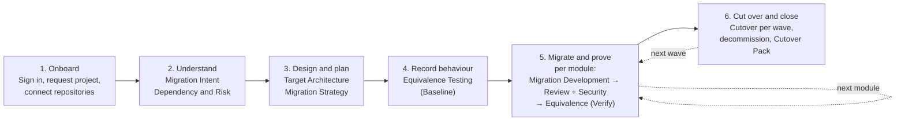

# Track 3 — Code Modernization: End-to-End Flow

**SDLC Platform · Flow document for customers and delivery teams**

| | |
|---|---|
| Version | 2.1 · 2026-09-28 (adds Part V: platform mechanisms and lessons from Track 1/2) |
| Branch read | `akshat_main` |
| Audience | Enterprise customers (Part I), delivery and engineering teams (Parts II–IV) |
| Sources | `track3-research.md` (primary), `track3-implementation-plan.md`, `track3-phase1-requirements-discovery.md`, `track3-agent-build-plan.md`, `track3-frontend-plan.md`, `track3-demo-claimtrack.md`, `../multi-track-agent-access-design.md`, `frontend/app/(auth)/login/`, `Track-3 Lessons from Track 1-2.md` (Part V) |

> ### Read this first: what is built and what is designed
>
> Track 3 has ten agents. **Two are built and verified**: *Migration Intent* and *Dependency
> and Risk*. **Eight are designed but not built**: *Target Architecture, Migration Strategy,
> Equivalence Testing, Migration Development, Migration Review, Security, Cutover, Cutover Pack*.
> Their behaviour, inputs, outputs and pass/fail rules come from the design in
> `track3-research.md` §5–§7 and §12.
>
> Every agent section carries a status label: **● BUILT** or **○ DESIGNED**. Anything described
> for a designed agent is how the platform is specified to behave, not something that runs
> today. The worked example in Part IV is **illustrative** after stage 2.

---

## Contents

**Part I — Executive overview**
1. [What Track 3 delivers](#1-what-track-3-delivers)
2. [The journey in six phases](#2-the-journey-in-six-phases)
3. [The ten agents at a glance](#3-the-ten-agents-at-a-glance)
4. [What you provide and what you receive](#4-what-you-provide-and-what-you-receive)
5. [How the programme is governed](#5-how-the-programme-is-governed)
6. [Who does what](#6-who-does-what)

**Part II — Agent-by-agent flow**
7. [How to read each agent section](#7-how-to-read-each-agent-section)
8. [Stage 0 — Sign-in and project onboarding](#8-stage-0--sign-in-and-project-onboarding)
9. [Agent 1 — Migration Intent](#9-agent-1--migration-intent)
10. [Agent 2 — Dependency and Risk](#10-agent-2--dependency-and-risk)
11. [Agent 3 — Target Architecture](#11-agent-3--target-architecture)
12. [Agent 4 — Migration Strategy](#12-agent-4--migration-strategy)
13. [Agent 5a — Equivalence Testing, Baseline mode](#13-agent-5a--equivalence-testing-baseline-mode)
14. [Agent 6 — Migration Development](#14-agent-6--migration-development)
15. [Agent 7 — Migration Review](#15-agent-7--migration-review)
16. [Agent 8 — Security](#16-agent-8--security)
17. [Agent 5b — Equivalence Testing, Verify mode](#17-agent-5b--equivalence-testing-verify-mode)
18. [Agent 9 — Cutover](#18-agent-9--cutover)
19. [Agent 10 — Cutover Pack](#19-agent-10--cutover-pack)

**Part III — Cross-cutting reference**
20. [Hand-over mechanics: how context moves](#20-hand-over-mechanics-how-context-moves)
21. [Artifact and file register](#21-artifact-and-file-register)
22. [Pass and fail conditions — master table](#22-pass-and-fail-conditions--master-table)
23. [Approval and gate matrix](#23-approval-and-gate-matrix)
24. [Loop-backs and escalation](#24-loop-backs-and-escalation)
25. [Revisions, reverts and rollbacks](#25-revisions-reverts-and-rollbacks)
26. [Security, data protection and compliance controls](#26-security-data-protection-and-compliance-controls)

**Part IV — Worked example, status and open decisions**
27. [Worked example: ClaimTrack](#27-worked-example-claimtrack)
28. [Delivery status](#28-delivery-status)
29. [Decisions still open](#29-decisions-still-open)

---

# Part I — Executive overview

## 1. What Track 3 delivers

Track 3 takes a **working legacy system and moves it onto a modern, supported stack without
changing what it does.** The result is the same business behaviour on a supported runtime,
framework, database and hosting platform, with evidence that the behaviour was preserved.

Three principles make Track 3 different from building new software:

| Principle | What it means for you |
|---|---|
| **Two repositories, always** | Your legacy repository is only ever **read**. The migrated code is written to a separate **target** repository. The legacy code stays untouched and remains the reference. |
| **"Done" means proven equivalent** | The legacy system's actual behaviour is **recorded before any code changes**. Each migrated module is replayed against that recording and must produce the same results under criteria you approve. |
| **Release is a series of controlled cutovers** | Modules move in **waves**. Each wave cuts over with traffic shifting or a parallel run, a rollback for every step, and a monitored hypercare period. The legacy system is switched off only at the end. |

Two rules apply to every agent:

- **Behaviour first.** No agent may change externally visible behaviour (a response field, a
  status code, a file layout, a report figure, a rounding rule, an ordering) unless a recorded
  architecture decision (ADR) says so and a person agreed. Keeping a legacy bug is the default.
- **No scope creep.** Nothing outside the agreed scope is touched. New features are not added
  during a modernization, because they cannot be proven equivalent.

## 2. The journey in six phases



| Phase | Purpose | Agents | Key decision you make | Output you approve |
|---|---|---|---|---|
| **1. Onboard** | Set up a governed project and give read access to the legacy code | — | Scope, budget, track | Project approval |
| **2. Understand** | Capture why and what, and measure the legacy estate objectively | Migration Intent, Dependency and Risk | Target stack, what must not change, success measures | Migration brief; risk assessment |
| **3. Design and plan** | Decide the target and how old and new coexist; sequence into waves with measurable pass criteria | Target Architecture, Migration Strategy | Patterns, frozen interfaces, wave order, dates, equivalence criteria | Target design; migration plan |
| **4. Record behaviour** | Record what legacy actually does, before anything changes | Equivalence Testing (Baseline) | Approve running the capture | Behaviour baselines |
| **5. Migrate and prove** | Migrate one module at a time, review it, scan it, prove it equivalent | Migration Development, Migration Review, Security, Equivalence Testing (Verify) | Approve each push; accept review, security and equivalence results | Pull request per module; review, security and equivalence sign-offs |
| **6. Cut over and close** | Move production wave by wave, switch off legacy, deliver closing evidence | Cutover, Cutover Pack | Go/no-go, downtime, each production step, decommission | Release sign-off per wave; cutover pack |

## 3. The ten agents at a glance

| # | Agent | Status | Owner (approves) | What it does | What it produces |
|---|---|---|---|---|---|
| 1 | **Migration Intent** | ● BUILT | Business Analyst | Captures why, scope, constraints, success measures; reads the legacy code; recommends the target stack | Migration Intent Brief (.docx/.pdf) |
| 2 | **Dependency and Risk** | ● BUILT | Business Analyst | Deterministic, read-only assessment: inventory, dependency graph, end-of-life, deprecated and vulnerable dependencies, 0–100 risk score and tier per module | Dependency and Risk assessment |
| 3 | **Target Architecture** | ○ DESIGNED | Architect | Target per layer, migration pattern per module, interop plan, frozen contracts, version traps, ADRs, diagrams | Target design document |
| 4 | **Migration Strategy** | ○ DESIGNED | Architect | Waves and order, equivalence criteria with normalization rules, baseline plan, freeze policy, rollback per wave, critical path, effort vs budget | Migration plan document |
| 5 | **Equivalence Testing** | ○ DESIGNED | QA | **Baseline mode:** records legacy behaviour before changes. **Verify mode:** replays it against migrated code, diffs outputs, compares performance | Baselines; equivalence results per module |
| 6 | **Migration Development** | ○ DESIGNED | Developer builds, Architect approves | Migrates one module at a time into the target repo: upgrade recipes first, AI-assisted rewrite for the rest, build migrated too | Pull request + module migration record |
| 7 | **Migration Review** | ○ DESIGNED | Architect | Side-by-side review of each migration PR against the legacy code, contracts, traps and design | Migration review report |
| 8 | **Security** | ○ DESIGNED | Security Engineer | Full scan stack on the migrated module plus a legacy-vs-target comparison: carried over / fixed / introduced | Security report and mandatory sign-off |
| 9 | **Cutover** | ○ DESIGNED | DevOps Engineer; business owner co-signs | Readiness, deployment package, traffic shift or parallel run, database switch, hypercare, decommission | Cutover plan and executed runbook per wave |
| 10 | **Cutover Pack** | ○ DESIGNED | Business Analyst (automatic acceptance) | Compiles closing evidence from everything recorded | As-built design, traceability map, evidence, ops hand-over, decommission note |

> Equivalence Testing appears twice in the flow (Baseline before migration, Verify after it)
> but is **one agent with one test harness**. Recording and replaying must share the same input
> handling and normalization, or the comparison means nothing.

## 4. What you provide and what you receive

### What you provide

| When | You provide | Used by |
|---|---|---|
| Onboarding | Project name, business intent, scope, budget; the track | Platform |
| Onboarding | Read access to the legacy repository; a new target repository with write access; your work-tracking board (optional) | All agents |
| Migration Intent | Why you are modernizing, what is in and out of scope, deadline, budget, change-freeze date, downtime windows, data residency, **what must not change**, **success measures**, business owner | Every later agent |
| Target Architecture | Answers to open design questions; confirmation of proposed frozen interfaces | Strategy onward |
| Migration Strategy | Decisions on date conflicts; parallel-run lengths; wave owners; business calendar facts | Testing, Migration Development, Cutover |
| Throughout | Approvals at every gate | — |

### What you receive

| Deliverable | From | Format |
|---|---|---|
| Migration Intent Brief | Migration Intent | Versioned document; .docx / .pdf |
| Dependency and Risk assessment | Dependency and Risk | Versioned report; module table, dependency graph, flags; .docx |
| Target design (patterns, contracts, traps, ADRs, AS-IS / TRANSITION / TO-BE diagrams) | Target Architecture | Versioned document; .docx / .pdf |
| Migration plan (waves, equivalence criteria, baseline plan, freeze policy, rollback, RAID, effort) | Migration Strategy | Versioned document; board items per wave |
| Behaviour baselines and noise report | Equivalence Testing | Baseline records (masked, hashed, in-region) |
| Migrated code, one pull request per module, with a legacy→target file map | Migration Development | Pull requests on your target repository |
| Migration review report per module | Migration Review | Versioned report |
| Security report, SBOM and sign-off per module | Security | Versioned report |
| Equivalence results per module (verdicts, differences, performance) | Equivalence Testing | Versioned report |
| Cutover plan, runbook and executed steps per wave; decommission record | Cutover | Versioned plan; deployment PR |
| Cutover Pack: as-built design, old→new traceability map, equivalence evidence, security evidence, ops hand-over, decommission note, results against the brief | Cutover Pack | Document set; documentation PR |

## 5. How the programme is governed

| Control | How it works |
|---|---|
| **Three kinds of action** | **Safe** (drafting, reading, scanning): no approval. **Consequential** (board writes, pushes, running captures, each production step): confirmed by the owner right before it runs. **Sign-off** (accepting a stage's output as the baseline): accepted by the owning role. |
| **No self-approval** | Nobody can approve a version they produced, including the Project Admin. |
| **Project Admin fallback** | Every gate can be decided by the owning role **or** a Project Admin of the project. Fallback decisions are labelled, need a reason, and are listed in the Cutover Pack. |
| **Mandatory gates** | Baseline acceptance, security sign-off, equivalence results per module, and release sign-off per wave. |
| **Two-person cutover** | Each wave's release is signed by the DevOps Engineer **and** the business owner. |
| **No AI override of a red gate** | Readiness for cutover is computed by a tool. The AI can explain a red result but cannot turn it green. Only a documented, approved waiver can. |
| **Least privilege** | Legacy is read-only by construction. Only the Migration Development writes the target, through a gated pull request. Production changes only through gated Cutover steps. |
| **Data protection** | Behaviour recordings are masked at capture, kept in your chosen region, retained under policy and never placed raw into an AI prompt. |
| **Full audit trail** | Every artifact version records what it was built from and who produced it. Every module transition and every gate decision is recorded. |

## 6. Who does what

| Role | Responsibilities on a Track 3 project | Owns | Chats with agents? |
|---|---|---|---|
| **Organization Admin** | Org-wide policy and budget | — | No (governance only) |
| **Business Unit Admin** | Approves the project request; registers connections (Azure DevOps, GitHub, …) and grants them to the Business Unit; grants extra agent access | — | No (governance only) |
| **Project Admin** | Staffs the project; wires connections to stages; fallback approver for every gate; owner-level access to every agent | Fallback for all ten | Yes |
| **Business Analyst** | Gives the migration intent; runs the assessment; compiles the closing pack | Migration Intent, Dependency and Risk, Cutover Pack | Yes |
| **Architect** | Designs the target; plans the waves; accepts migrated modules and reviews | Target Architecture, Migration Strategy, Migration Review; accepts Migration Development output | Yes |
| **Developer** | Drives the Migration Development; fixes findings | Builds with Migration Development | Yes |
| **QA / Tester** | Records baselines; verifies each module | Equivalence Testing | Yes |
| **Security Engineer** | Scans each module; issues the mandatory sign-off | Security | Yes |
| **DevOps Engineer** | Plans and runs cutovers, hypercare and decommission | Cutover | Yes |
| **Business owner** | Co-signs downtime, wave releases and decommission | Co-signs Cutover | Not required |

"Owning" an agent means being the person asked to approve its Consequential actions and
Sign-offs. Others with access can open it, chat with it and use its Safe capabilities, but
cannot approve anything on it.

---

# Part II — Agent-by-agent flow

## 7. How to read each agent section

Every agent section uses the same template:

| Heading | Meaning |
|---|---|
| **Status / Owner / Driven by / Where** | Build status, who approves, who operates it, which page or channel |
| **Entry conditions** | What must be true before the agent may start |
| **Inputs received** | The exact artifacts and files handed to it, and who produced them |
| **What the person provides** | What the operator must tell the agent |
| **Actions** | Every action the agent takes, in order |
| **Outputs** | The artifacts and files it produces, with their storage location |
| **Pass conditions** | What must be true for the stage to be accepted |
| **Fail conditions** | What stops or rejects the stage, and what happens next |
| **Gates** | Consequential actions and the Sign-off, with approvers |
| **Hand-over** | Who receives the work next, the package they receive, and the module state change |
| **Never does** | Hard limits on the agent |

The **module state** refers to the Module Migration Ledger (section 20.3): one record per legacy
module that moves through `assessed → designed → sequenced → baselined → migrating → in_review →
verifying → verified → cut_over → retired`, with `blocked` reachable from any state.

---

## 8. Stage 0 — Sign-in and project onboarding

**Status:** ● BUILT (legacy side) · target-repository wiring ○ DESIGNED
**Actors:** Requester, Business Unit Admin, Project Admin

### 8.1 Sign-in

| Step | What happens |
|---|---|
| 1 | The user opens the platform at **Sign in** (`/login`). Depending on the deployment: single sign-on through the organisation's identity provider (Auth0), email and password, or a test persona panel in development environments. |
| 2 | The platform checks that the account belongs to an **active Business Unit**. If not: *"Business Unit not found — ask your admin to invite you."* An expired session returns here with *"Your session expired."* A rejected SSO handshake shows *"SSO handshake failed."* |
| 3 | On success the user lands on the **Dashboard** (`/dashboard`), or the page they originally requested. |

**Established:** the user's identity, Business Unit and project roles. Every later check (visible
agents, approval rights, usable connections) starts from this.

### 8.2 Request and approve the project

| Step | Actor | Action |
|---|---|---|
| 1 | Business Unit Admin, or a Project-Admin-capable user submitting a request | **Request a project**: name, business intent, scope, budget, **delivery track**. The track picker shows five tracks with their agent rosters. |
| 2 | Requester | Selects **Code Modernization (Track 3)**. |
| 3 | Business Unit Admin | **Approves** the request. The track is then **locked** (`projects.track = 'modernization'`). A wrong track means a new project. |

### 8.3 Staff the project

The **Project Admin** adds members in their roles (Business Analyst, Architect, Developer, QA,
Security Engineer, DevOps Engineer) and records the business owner. Extra agent access, if
needed, is granted role-wide or to one named person on Roles & Access. Extra access gives chat
and Safe use only, never approval rights.

**Recommended:** at least two Project Admins, or every owning role staffed, so that no gate
deadlocks under the no-self-approval rule.

### 8.4 Connect repositories and the board

Access to any repository is granted only through this chain: **Business Unit grant (Integrations
page) → wired to the specific stage → access level**. There is no fallback from one stage's
connection to another stage's.

| Connection | Reference | Wired to | Access | Status |
|---|---|---|---|---|
| Legacy repository | `legacy` | Migration Intent, Dependency and Risk, and every later stage that reads legacy | read | ● BUILT |
| Target repository (new, usually empty) | `target` | Migration Development and Cutover: write. Review, Security, Equivalence Testing, Cutover Pack: read | read / write | ○ DESIGNED |
| Work-tracking board (Azure DevOps Boards / Jira) | — | Migration Intent, Migration Strategy | write (Consequential) | ● BUILT for Migration Intent |

Without a permitted connection, only a **public** repository can be pulled.

### 8.5 Open the project

Members see only the **Track 3 agent tiles**, in hand-off order. Each tile shows one state:

| Tile state | Meaning |
|---|---|
| Full access (owner) | The person's own agent; approval controls appear when a gate fires |
| Use-only | Can chat and use Safe capabilities; cannot approve |
| Locked — request access | In the roster, but the person has no access |
| Coming soon | In the roster but not yet built and verified (today: agents 3–10) |

### 8.6 Pull the legacy code

| | |
|---|---|
| How | On the Migration Intent or Dependency and Risk page: *Pull legacy code* → project → repository → branch → Pull. The Migration Intent agent can also pull it when asked in its chat. |
| Where stored | **One checkout per project**: `files/legacy-code/<project>/checkout`, with the pull record in `pull.json` |
| Shared with | Every agent page on the project (no second pull) |

The pull is **read-only by construction**: shallow clone, push URL disabled, no write tools.
Only bare https URLs for GitHub, Azure DevOps, GitLab and Bitbucket are accepted. The credential
comes only from the connection wired to the asking stage.

**Pass:** checkout present; repository, branch and **commit** recorded.
**Fail:** no permitted connection for a private repository, or a URL outside the supported
hosts → nothing is pulled; the Project Admin must wire the connection.

**Hand-over:** the Business Analyst starts Agent 1.

---

## 9. Agent 1 — Migration Intent

| | |
|---|---|
| **Id** | `requirements_modernization` |
| **Status** | ● BUILT |
| **Owner** | Business Analyst (Project Admin fallback) |
| **Driven by** | Business Analyst (Project Admin can also run it) |
| **Where** | `/projects/[id]/requirements-modernization` |

### Purpose
Captures **why** the modernization is happening, what is in scope, the constraints and the
success measures. States the **current** stack from the code, **recommends** the target stack
and records the **Migration Intent Brief**.

### Entry conditions
- Track 3 project approved and staffed.
- Legacy code pulled, or pullable by this agent through the connection wired to its stage.

### Inputs received
| Input | From | Form |
|---|---|---|
| Pulled legacy code | Stage 0 | Checkout, read through a deterministic stack profile plus file listing, reading and search |
| The user's description and attachments | Business Analyst / Project Admin | Chat |
| The project's **approved tech stack**, if one exists | Agent Studio (Business Unit default or project selection) | Read with its source (`project selection` / `BU default` / `none`). When present, the recommendation starts from it and any departure is stated with a reason; when `none`, the agent recommends freely as today |
| **Project documents** uploaded for this project (legacy design notes, runbooks, interface specs, data dictionaries) | Anyone with `run:create`, approved by the owner | Metadata first, text fetched on demand with `read_document`; each cited by name |

### What the person provides
Why (drivers: end of support, audit findings, hosting exit, skills), scope in and out, deadline,
budget, change-freeze date, downtime windows, data residency, interfaces/files/reports that
**must not change**, success measures (today's value and target), business owner and
stakeholders. The person does **not** need to name the target stack; the agent recommends one.

### Actions
1. If asked, lists the repositories the stage's connection can see and **pulls the legacy code**
   read-only.
2. Profiles the code and **states the current stack**; asks the user to confirm it.
3. Asks **focused follow-up questions** when the description is thin. It does not invent scope,
   constraints or success criteria.
4. **Recommends a target** per part of the system, with the reason, the concrete change per
   module, trade-offs and rejected alternatives, and asks whether it looks right.
5. Answers follow-ups from the code (e.g. "where does the web app call the external service?").
6. On the user's agreement, **records the brief**, containing only what the user said or
   confirmed. Its own examples never land in the brief.
7. Freezes the brief as a **stage version**; exports it as a designed **.docx / .pdf**.
8. Optionally, **writes the migration Epic and items to the board** (Consequential).

### Outputs
| Output | Storage | Content |
|---|---|---|
| **Migration Intent Brief vN** | `runs.migration_intent_payload`; frozen in `artifact_versions` | Goal, drivers, layers today → target, recommendation, module changes, trade-offs, scope, constraints, deadline, budget, milestones, success criteria and measures, stakeholders, assumptions, risks, open questions |
| Brief export | `GET /projects/{id}/modernization/{kind}/versions/{v}/export` | .docx / .pdf |
| Board items (optional) | Connected board | Migration Epic and items |

**Designed additions** (not yet built): a `must_not_change` list recorded word for word, which
Target Architecture turns into frozen contracts; and a `kind` on each success measure
(`equivalence | performance | security | schedule | cost`) so Strategy can generate criteria
from them directly.

### Pass conditions
- The brief is recorded with the user's confirmed content.
- A Business Analyst who did not produce it, or a Project Admin, **approves** it.

### Fail conditions
| Condition | Result |
|---|---|
| Description too thin | Agent asks follow-up questions; nothing is recorded yet |
| Code cannot be pulled (no permitted connection, private repo) | Agent reports it; only public repositories can be pulled without a wired connection |
| Brief rejected at sign-off | Revised and re-recorded as a new version |

### Gates
| Type | Action | Approver |
|---|---|---|
| Consequential | Write Epic/items to the board | Business Analyst / Project Admin, explicit yes on that turn |
| Sign-off | Baseline the brief | Business Analyst (not the producer) / Project Admin |

### Hand-over → Agent 2 (Business Analyst) and later Agent 3 (Architect)
```yaml
artifact: migration_intent_payload
version: 1
status: approved
target_stack: "<recommended and confirmed target per layer>"
scope: {in: [...], out: [...]}
constraints: [deadline, freeze date, downtime window, region, budget]
success_measures: [{metric, today, target}]
must_not_change: [...]      # designed addition
open_questions: [...]       # e.g. questions left to Architecture
```

### Never does
Invents scope, constraints or criteria; records its own examples; writes to the board without an
explicit yes.

---

## 10. Agent 2 — Dependency and Risk

| | |
|---|---|
| **Id** | `discovery` |
| **Status** | ● BUILT |
| **Owner** | Business Analyst (Project Admin fallback) |
| **Driven by** | Business Analyst (Project Admin can also run it) |
| **Where** | `/projects/[id]/discovery` |

### Purpose
A **deterministic, read-only** assessment of the legacy repository. No AI model is involved in
the analysis; the model only explains the result.

### Entry conditions
- Legacy code pulled (the page header shows the pulled repository and commit; no second pull).
- A brief is available (approved first, else the newest draft unless publication is enforced).

### Inputs received
| Input | From | Form |
|---|---|---|
| Legacy checkout | Stage 0 / Agent 1 | The same checkout Agent 1 used |
| Migration Intent Brief | Agent 1 | The Migration Intent page's versions |

### What the person provides
"Assess the legacy code that is already pulled", optionally restating the target. Follow-up
questions are answered from the report.

### Actions
1. Confirms the repository and commit.
2. Builds the **inventory** of modules, languages and lines of code (vendored files excluded).
3. Parses **manifests**: Maven/Gradle, npm, pip and .NET.
4. Builds the **dependency graph** between modules.
5. Checks runtimes against a **dated end-of-life table** (Java, Node, Python, .NET).
6. Flags **deprecated** packages.
7. Runs **Trivy** for known vulnerabilities (CVEs).
8. Computes an **attributed 0–100 risk score** per module from: size (≤20), runtime end-of-life
   15 / approaching 8 / legacy 5, platform blockers (≤25), dependency count (≤10), deprecated
   (≤10), vulnerable (≤10), coupling/fan-in (≤10), no tests (5).
9. Assigns a **tier** per module:
   - `manual` — a hard blocker, or score ≥ 70
   - `mechanical` — no blockers, score < 35, and the target is the same language
   - `llm_assisted` — everything else
10. Records the assessment, freezes it as a version, and replies with the report and assessment
    notes, naming each flag exactly as the report does.
11. Answers follow-ups ("why is this module mechanical?", "which dependencies must be replaced?",
    "show me the details for module X") and exports the assessment as Word.

### Outputs
| Output | Storage | Content |
|---|---|---|
| **Dependency and Risk assessment vN** | `runs.discovery_artifacts` (schema v1); frozen in `artifact_versions` | Repository and commit, inventory, per-module ecosystem, runtime and status, LOC, dependencies, blockers, `risk.score`, `risk.tier`, attributed `risk.factors`; dependency graph; flags `{eol, deprecated, vulnerable}`; `golden_master: not_captured` |
| Export | Version export endpoint | .docx / .pdf |

**Designed additions:** module ids **M-01, M-02 …** minted in the assessment (stable within a
commit) for every later agent to cite; a **"Not assessable statically"** section (e.g. the
production runtime actually used, scheduler configuration held outside the repository,
environment-specific configuration) passed to Target Architecture as questions; and
`golden_master` becoming a pointer to the baseline ids once Agent 5 records them.

### Pass conditions
- The assessment is recorded against a known commit.
- A Business Analyst who did not produce it, or a Project Admin, **accepts it as the planning
  baseline**.

### Fail conditions
| Condition | Result |
|---|---|
| No pulled code and no permitted connection | Nothing to assess; pull first |
| Assessment rejected | Re-run and re-record as a new version |

### Gates
| Type | Action | Approver |
|---|---|---|
| Sign-off | Accept the assessment as the planning baseline | Business Analyst (not the producer) / Project Admin |

### Hand-over → Agent 3 (Architect)
```yaml
artifact: discovery_artifacts
version: 1
status: approved
commit: "<pulled commit>"
modules: [{id: M-01, name, tier, score, factors, runtime, flags}]
graph: [[M-02, M-01], ...]
flags: {eol: [...], deprecated: [...], vulnerable: [...]}
golden_master: {status: not_captured}
not_assessable_statically: [...]    # designed addition
```

### Never does
Executes the legacy code; writes to any repository; lets the model change a score, tier or count.

> **The built flow ends here.** Agents 3–10 below are designed, not built.

---

## 11. Agent 3 — Target Architecture

| | |
|---|---|
| **Id** | `design_modernization` |
| **Status** | ○ DESIGNED |
| **Owner** | Architect (Project Admin fallback) |
| **Driven by** | Architect (Project Admin can also run it) |
| **Where** | `/projects/[id]/target-architecture` |

### Purpose
Decides **what the system becomes** and **how the old and new coexist while it moves**.

### Entry conditions
- Brief and assessment exist. If either is missing, the agent says which and that the design is
  provisional. If either is not approved, it says so.

### Inputs received
| Input | From | Storage |
|---|---|---|
| Migration Intent Brief (approved first, else newest draft) | Agent 1 | `runs.migration_intent_payload` |
| Assessment (approved first, else newest draft) | Agent 2 | `runs.discovery_artifacts` |
| Legacy code, read-only | Stage 0 | Checkout |
| Approved tech stack for the project (or BU default) | Agent Studio | The stack table is the source of truth for **which** technologies are approved; **versions are chosen by the agent and checked against the assessment's end-of-life table**. A choice outside the stack is recorded as an ADR |
| Project documents (legacy specs, runbooks, database dictionaries) | Project documents | `read_document`; cited in ADRs and in "Not assessable statically" answers |

When publication is enforced for the project, "approved first, else newest draft" becomes
"**published only**": no fallback to a draft, and every read is recorded as a consumption.

### What the person provides
"Design the target from the approved brief and assessment." Then answers to at most three
questions at a time, and confirmation of any contract the brief did not name.

### Actions
1. Reads the brief, the assessment and a deterministic **inventory of legacy interfaces**: HTTP
   endpoints (Spring / JAX-RS mappings, `web.xml` servlets, JSP routes), outbound HTTP clients,
   files written and read, scheduled jobs (Quartz/cron), and database tables from DDL and queries.
2. Reads the code behind each decision (entry points, shared libraries, hosting and database
   configuration, scheduled jobs) and says where it looked.
3. Decides the **target per layer** (hosting, runtime, framework, database, front end, CI/CD,
   observability, identity) with exact, supported versions — never end-of-life, never "latest".
4. Assigns a **migration pattern per module** from a fixed vocabulary, citing the module's tier,
   risk factors and coupling:
   `in_place_upgrade`, `strangler_fig`, `branch_by_abstraction`, `parallel_run`, `rewrite`,
   `replatform`, `retire`, `keep` (a module may combine two).
5. Writes the **interop plan**: routing, data (shared DB, replication or dual-write with a
   reason), libraries used by both sides, identity and sessions, and scheduled jobs so nothing
   runs or sends twice.
6. Defines **frozen contracts CT-xx**: each with name, kind (http/file/report/db/queue/event),
   legacy location, consumers and **proof method**. A contract the brief did not name is
   `proposed` until the user confirms it.
7. Plans the **data migration**: source and target engine and versions, method, engine behaviour
   changes that affect the queries, cutover approach.
8. Sets **non-functional targets** from the brief and the **security design** changes.
9. Names the **version traps TR-xx** that apply to this code, citing where each bites (e.g.
   changed URL matching, collation, GROUP BY ordering, rounding, integer division, map ordering,
   host time zone).
10. Records **ADRs** (context, ≥2 options, decision, consequences, modules and contracts touched),
    including decisions taken from the brief.
11. Draws **AS-IS, TRANSITION and TO-BE** C4 diagrams (Mermaid).
12. Decides **open questions** the brief left to architecture by recommending and asking for
    confirmation.
13. Presents the design compactly (under ~300 words), revises with the user, and **records only
    after agreement**.
14. Exports the design document and raises it for approval.

### Outputs
| Output | Storage |
|---|---|
| **Target design vN**: summary, layers, modules with patterns, interop, frozen contracts, data migration, NFRs, security design, traps, ADRs, diagrams, departures from the brief, open questions | `runs.target_design_artifacts` (new column), versioned |
| Design document | .docx / .pdf |
| Ledger rows, one per module → **`designed`** | `modernization_modules` (new table) |

### Pass conditions
The record tool **refuses** the design unless:
- every in-scope module has ≥1 pattern, and every pattern is in the vocabulary;
- every contract has a legacy location;
- every ADR has ≥2 options;
- no version named is past end-of-life (checked against the assessment's EOL table).

Acceptance checks: every must-not-change item has a contract; diagrams parse; re-running with
the same inputs gives the same modules, contracts and patterns. Then an Architect who did not
produce it, or a Project Admin, **accepts the target design**.

### Fail conditions
| Condition | Result |
|---|---|
| Validator refusal (above) | Agent fixes what the tool reports and records again |
| Brief or assessment missing / unapproved | Design marked provisional |
| A contract cannot be located in legacy | Marked `proposed`, not `confirmed` |
| A newer approved brief or assessment exists | Design is **stale**; agent says so on its first reply and offers to revise |
| Rejected at sign-off | Revised; the whole design is re-recorded (newest version wins) |

### Gates
| Type | Action | Approver |
|---|---|---|
| Sign-off | Accept the target design | Architect (not the producer) / Project Admin |

### Hand-over → Agent 4 (Architect)
```yaml
artifact: target_design_artifacts
version: 1
status: approved
built_from: [{migration_intent_payload: 1}, {discovery_artifacts: 1}]
patterns: {M-01: [in_place_upgrade], M-02: [in_place_upgrade, strangler_fig], ...}
ordering_constraints: ["<interop constraints that restrict wave order>"]
contracts: [CT-01, ...]
traps: [TR-01, ...]
adrs: [ADR-01, ...]
```
**Ledger:** all in-scope modules → `designed`.

### Never does
Adds features; changes scope; sets wave dates; changes a score or tier; changes externally
visible behaviour without an ADR the user agreed to.

---

## 12. Agent 4 — Migration Strategy

| | |
|---|---|
| **Id** | `strategy` |
| **Status** | ○ DESIGNED |
| **Owner** | Architect (Project Admin fallback) |
| **Driven by** | Architect (Project Admin can also run it) |
| **Where** | `/projects/[id]/strategy` |

### Purpose
Turns the design into a plan that can be **executed and proven**: which modules move in which
wave, what "equivalent" means for each module, what behaviour must be recorded first, when the
legacy freezes, and how each wave rolls back.

### Entry conditions
- Target design exists. If missing or unapproved, the plan is provisional.

### Inputs received
| Input | From | Storage |
|---|---|---|
| Brief (dates, budget, milestones, freeze, windows, downtime limits, must-not-change, success measures) | Agent 1 | `runs.migration_intent_payload` |
| Assessment (modules, graph, scores, tiers) | Agent 2 | `runs.discovery_artifacts` |
| Target design (patterns, interop, contracts, data migration, ADRs, traps) | Agent 3 | `runs.target_design_artifacts` |
| Module ledger | Agent 3 | `modernization_modules` |

### What the person provides
"Plan the waves." Then **decisions on every date conflict** reported, parallel-run lengths, wave
owners, and business calendar facts the documents cannot answer.

### Actions
1. Reads the three upstream artifacts.
2. Calls a deterministic **wave-order** tool: a topological sort of the dependency graph combined
   with the interop constraints and risk scores. Returns the order, the edges that forced it, and
   any cycles.
3. Calls a deterministic **calendar check**: lays the brief's milestones, freeze date and cutover
   windows against the proposed waves and returns conflicts, including conflicts inside the brief.
4. Calls a deterministic **effort estimate**: bands from tier × LOC × pattern, labelled as an
   estimate.
5. Builds **waves**: W0 is always the foundation (environments, pipelines, target data platform,
   observability, **baseline capture**). Then real waves, **lowest risk first** by default, with a
   stated reason for every change to the tool's order.
6. Writes **equivalence criteria EC-xx** per module. Each has: the module; what it protects (CT,
   TR or success measure); the **observable**; the **input set**; the **comparison**
   (`exact | byte_identical | numeric_tolerance | schema_equal | set_equal |
   percentile_threshold`); the **normalization rules**, each with a reason; the threshold. Exact
   is the default. Every trap becomes or is covered by a criterion. Performance and security
   measures become criteria too.
7. Writes the **baseline plan** per criterion: inputs, environment, data source, masking rule,
   due date before the freeze.
8. Per wave: modules, patterns, entry criteria, exit criteria (the ECs, security sign-off,
   parallel-run period), cutover window, rollback trigger, rollback method, owner.
9. Writes the **legacy change-freeze policy**: from when, what is allowed (e.g. P1 only), and how
   an allowed legacy fix is carried to the target and re-baselined.
10. States the **critical path**, **RAID** (risks with evidence, assumptions, issues,
    dependencies), and **effort vs budget**.
11. Presents the plan compactly (under ~300 words), including every date conflict, and **records
    only after agreement**.
12. Shows the board items (one Feature per wave, one item per module with its ECs) and writes
    them **only after an explicit yes** (Consequential). If no board is connected, says so.
13. Exports the plan document and raises it for approval.

### Outputs
| Output | Storage |
|---|---|
| **Migration plan vN**: summary, waves, equivalence criteria, baseline plan, freeze policy, critical path, calendar conflicts, RAID, effort, budget fit | `runs.strategy_artifacts` (new column), versioned |
| Plan document | .docx |
| Board items | Connected board |
| Ledger → **`sequenced`** with `wave`, `ec_ids` | `modernization_modules` |

### Pass conditions
The record tool **refuses** the plan unless:
- every in-scope module is in **exactly one** wave;
- every EC has an observable, an input set and a comparison;
- every normalization rule has a reason;
- every wave has a rollback.

Acceptance checks: dependency order respected; every EC testable as written; no *unreported*
calendar conflict; effort labelled as an estimate. Then an Architect who did not produce it, or a
Project Admin, **accepts the migration plan**.

### Fail conditions
| Condition | Result |
|---|---|
| Wave order violates a dependency | Blocked by the wave-order tool |
| Vague criterion ("works the same") | Refused: needs observable, input set and comparison |
| Date conflict | Surfaced to the user with options; the agent never moves a user's date; derived dates are labelled `proposed` |
| Plan needs a tier, pattern or contract changed | Agent says so and names the agent that owns it |
| Newer approved upstream version | Plan is stale; agent says so first |
| Normalization-rule proposal from Equivalence Testing | Plan revised and re-approved (section 24) |

### Gates
| Type | Action | Approver |
|---|---|---|
| Consequential | Write waves/items to the board | Architect / Project Admin, explicit yes |
| Sign-off | Accept the migration plan | Architect (not the producer) / Project Admin |

### Hand-over → Agent 5a (QA), then Agent 6 (Developer)
```yaml
artifact: strategy_artifacts
version: 1
status: approved
waves: [{id: W0, modules, starts, ends, date_status, entry_criteria, exit_criteria,
         parallel_run, cutover_window, rollback: {trigger, method, max_time}, owner}]
equivalence_criteria: [{id: EC-01, module_id, protects, observable, input_set,
                        comparison, normalization: [{field, rule, reason}], threshold}]
baseline_plan: [{ec_id, inputs, environment, data_source, masking, due}]
freeze_policy: {from, allowed, carry_forward}
```
**Ledger:** modules → `sequenced`.

### Never does
Changes a tier, pattern or contract; invents a date, number or dependency; quietly moves a date
the user gave.

---

## 13. Agent 5a — Equivalence Testing, Baseline mode

| | |
|---|---|
| **Id** | `testing_modernization` |
| **Status** | ○ DESIGNED |
| **Owner** | QA (Project Admin fallback) |
| **Driven by** | QA (Project Admin can also run it) |
| **Where** | `/projects/[id]/equivalence-testing` |

### Purpose
Records what the legacy system **actually does** for the agreed inputs, **before any code
changes** and before the freeze. This is Wave 0. **No module may be migrated without an accepted
baseline.**

### Entry conditions
- An **approved** migration plan. Without one, the agent explains what it would do but does not
  capture.
- Mode selection: the user asks to record/capture/baseline, or a module is `sequenced` with no
  accepted baseline.

### Inputs received
| Input | From | Storage |
|---|---|---|
| ECs and the baseline plan | Agent 4 | `runs.strategy_artifacts` |
| Contracts, traps, ADRs | Agent 3 | `runs.target_design_artifacts` |
| Module ledger | Agents 3–4 | `modernization_modules` |
| Legacy code, read-only | Stage 0 | Checkout |

### What the person provides
"Record the baselines" (or for one module), then **explicit approval to run** the capture.

### Actions
1. Reads the plan, the design and the ledger.
2. Turns the baseline plan into concrete **scenarios**: HTTP (recorded through a proxy), batch
   (DB snapshot in → files/rows out), reports (DB snapshot → file), UI (scripted journeys).
3. Shows the scenarios in a short list — what runs, how many inputs, data source, how personal
   data is masked, which external calls are stubbed — and **asks to go ahead** (Consequential).
4. Provisions a **legacy runtime sandbox**: legacy runtime image by digest, **no network egress**,
   database seeded from a **masked snapshot**, external services **stubbed** with recorded
   responses.
5. Runs the legacy system **twice**: once to capture, once to measure its **noise floor**.
6. For every field that differs between the two legacy runs and is not already covered by a
   normalization rule, **proposes a rule to Migration Strategy** (field, rule, evidence). It never
   applies one itself.
7. Records the baselines **BL-xx** (ids, counts, hashes) and the noise report.
8. Replies with what was recorded per criterion, anything nondeterministic that needs a rule, and
   that the baseline needs acceptance before the Migration Development starts.

### Outputs
| Output | Storage |
|---|---|
| **Baselines BL-xx**: masked, hashed, stored in-region | `runs.equivalence_artifacts` (new column), blob storage in the brief's region |
| Noise report | Same |
| Stub catalogue (recorded external responses) | Same |
| Ledger → **`baselined`**; assessment's `golden_master` → `{status: captured, baselines: [BL-…]}` | `modernization_modules`, `runs.discovery_artifacts` |

### Pass conditions
- Capture completed for the module's criteria.
- Acceptance check: legacy replayed against its own baseline gives **zero differences** after
  normalization.
- A QA who did not produce it, or a Project Admin, **accepts the baseline** (mandatory).

### Fail conditions
| Condition | Result |
|---|---|
| No approved plan | Agent does not capture; names Migration Strategy |
| Unexplained noise (field varies between two legacy runs) | Rule proposed to Strategy; the affected EC stays **open** until the plan is revised and re-approved |
| Capture not approved | Nothing runs |
| Baseline rejected | Re-capture as a new baseline version (baselines are never overwritten) |

### Gates
| Type | Action | Approver |
|---|---|---|
| Consequential | Run the capture against legacy | QA / Project Admin, explicit yes |
| Sign-off (**mandatory**) | Accept the baseline | QA (not the producer) / Project Admin |

### Hand-over → Agent 6 (Developer)
```yaml
artifact: equivalence_artifacts
baselines: [{id: BL-01, ec: EC-01, cases: 10000, sha256: "...", region: "..."},
            {id: BL-02, ec: EC-04, noise_fields: ["..."]}]
stubs: ["<recorded external services>"]
```
**Ledger:** module → `baselined`.

### Never does
Applies or loosens a normalization rule; sends a recording or raw record to the model; calls a
real external service during capture.

---

## 14. Agent 6 — Migration Development

| | |
|---|---|
| **Id** | `development_modernization` |
| **Status** | ○ DESIGNED |
| **Owner** | Developer builds; Architect approves (Project Admin fallback) |
| **Driven by** | Developer (Project Admin can also run it) |
| **Where** | `/projects/[id]/migration-development` |

### Purpose
Migrates the legacy system into the **target** repository **one module at a time**, following
the approved plan, so the migrated module does exactly what the legacy module did.

### Entry conditions
- The module's **baseline is accepted**. If not, the agent refuses to start: *the baseline must
  exist before the code changes.* This rule cannot be overridden.
- The module's wave has started. The user **may** override the wave order.
- The `target` repository is wired to this stage with write access.

### Inputs received
| Input | From | Storage |
|---|---|---|
| Module plan: tier, pattern, wave, contracts, traps, ECs, baseline status | Agents 2–5a | Ledger + `get_module_plan` |
| Target design (stack and versions, interop, ADRs) | Agent 3 | `runs.target_design_artifacts` |
| Migration plan (wave and criteria) | Agent 4 | `runs.strategy_artifacts` |
| Legacy code (read) | Stage 0 | Checkout |
| Baselines (for the preview) | Agent 5a | `runs.equivalence_artifacts` |
| **On rework:** findings F-xxx, S-xxx, EQ-xxx | Agents 7, 8, 5b | Their reports |

### What the person provides
"Start wave N" or "Migrate `<module>`", then **explicit approval to push** and open the PR.

### Actions
1. States in two or three lines the module, tier, pattern, target, and the contracts and traps it
   will keep in view.
2. **Opens the target workspace**: clones the target repository and creates `migrate/<module>`.
   For an in-place upgrade, commits the legacy module unchanged as **commit 1**, so the recipe
   diff can be reviewed on its own.
3. **Routes by tier:**
   - **Mechanical:** lists the allow-listed upgrade recipes (pinned versions: OpenRewrite,
     2to3/pyupgrade, try-convert, …), runs those the target calls for, builds, fixes what does
     not compile.
   - **LLM-assisted:** runs the recipes that apply, then rewrites the rest **file by file**,
     reading each legacy file before writing its replacement, keeping names and structure
     recognisable for side-by-side review.
   - **Manual-only:** does **not** attempt it. States what a person must redesign and why (the
     assessment's blockers), sets the module to **`blocked`**, and stops.
4. **Migrates the build** as its own step and **own commit**: build file, dependency versions, CI
   definition, container/hosting configuration.
5. **Keeps every contract** on the module exactly as legacy has it (path, method, status codes,
   field names and types, file layout, column order, encoding) and shows **where each trap was
   handled**.
6. Runs **build, tests and lint** until green — **at most five rounds**. If still red, stops,
   states exactly what fails and why, and records it.
7. Runs an **equivalence preview** on a small baseline sample. A hint, not a verdict.
8. **Records the module migration**: recipes and versions, what became of each legacy file
   (mapped / merged / dropped with a reason), what was rewritten by hand and why, traps handled
   and where, anything left for a person.
9. Shows the branch, commits, PR title and body, and **pushes and opens the PR only after an
   explicit yes** (Consequential). The PR body is generated from the record.
10. Replies with the PR, the headline, anything left for a person, and the next step.
11. **On rework:** reads every F-xxx, S-xxx and EQ-xxx; fixes on the same branch, one commit per
    finding where practical, stating which commit answers which finding. For a finding it
    disagrees with, explains why using the legacy code as evidence, and leaves the decision to
    the reviewer.

### Outputs
| Output | Storage |
|---|---|
| **One pull request per module** on the target repository, commits split by concern (recipe / build / hand fixes) | Target repository |
| **Module migration record** (recipes with versions, files changed, **legacy→target file map**, build and test results, LLM-rewritten parts and why, traps handled, manual follow-ups) | `runs.migration_artifacts` (new column), per module, versioned |
| Ledger: `baselined → migrating → in_review` | `modernization_modules` |

### Pass conditions
The record tool **refuses** the record unless:
- the file map covers **every** legacy file in the module (mapped / merged / dropped with reason);
- nothing outside the module path is touched (except shared build files assigned to this wave);
- the build is green.

Acceptance checks: on a mechanical module, recipes alone give a green build after compile fixes;
the preview sample is shown before the PR opens. The Architect (or Project Admin) **accepts the
migrated module**.

### Fail conditions
| Condition | Result |
|---|---|
| Baseline not accepted | Does not start |
| Manual tier | Module → `blocked` with a hand-off note |
| Build still red after 5 rounds | Stops; failure recorded; person decides |
| Push not approved | No push; nothing leaves the workspace |
| Review requests changes / Security FAIL / equivalence regression | Rework loop on the same branch (section 24) |

### Gates
| Type | Action | Approver |
|---|---|---|
| Consequential | Push and open the PR | Developer confirms (Architect / Project Admin), explicit yes |
| Sign-off | Accept the migrated module | Architect / Project Admin |

### Hand-over → Agents 7 and 8 (Architect, Security Engineer)
```yaml
artifact: migration_artifacts[M-05]
version: 1
pr: "<target repo>!12"
recipes: [{tool, version/args}]
file_map: {mapped: 12, merged: 2, dropped: 0}
llm_rewritten: ["<file: reason>"]
traps_handled: {TR-03: "<file:line>", ...}
manual_follow_ups: [...]
```
**Ledger:** module → `in_review`.

### Never does
Writes to the legacy repository; touches files outside the module path; adds features or
refactors beyond what the target needs; fixes legacy bugs without an ADR; copies any secret,
password, key or connection string (uses vault references and lists what must be provisioned);
uses end-of-life or "latest" versions; runs non-allow-listed commands or recipes; claims a build,
test or sample passed that the tools did not report as passing.

---

## 15. Agent 7 — Migration Review

| | |
|---|---|
| **Id** | `code_review_modernization` |
| **Status** | ○ DESIGNED |
| **Owner** | Architect (Project Admin fallback) |
| **Driven by** | Developer requests it; Architect or Project Admin |
| **Where** | `/projects/[id]/migration-review` |
| **Runs alongside** | Security, on the same pull request |

### Purpose
Reviews **one module's migration PR** side by side with the legacy code it replaces, and gives a
merge recommendation. **Read-only** on both repositories: never modifies code, pushes or comments
on the PR itself.

### Entry conditions
- A PR exists for the module. If there is no Migration Development record, it reviews the diff alone and says
  the traceability check could not be done.

### Inputs received
| Input | From | Storage |
|---|---|---|
| PR diff on the target repository | Agent 6 | Target repository |
| Module migration record and file map | Agent 6 | `runs.migration_artifacts` |
| Legacy counterpart of every judged file | Stage 0 | Checkout (via the file map) |
| Pattern, ADRs, contracts, traps | Agent 3 | `runs.target_design_artifacts` |
| The module's ECs | Agent 4 | `runs.strategy_artifacts` |

### What the person provides
"Review PR N."

### Actions
1. Reads the Migration Development agent's record, the design and the plan.
2. Runs a deterministic **API-surface comparison**: every route (path, method, params, status
   codes), public method, SQL statement and file format changed between legacy and target. Any
   change to a frozen contract is **at least high** unless an ADR allows it (cited).
3. For each **trap** on the module, finds where the new code handles it. Unhandled = **high**.
4. Checks **traceability**: every legacy file mapped, merged or dropped with a reason.
5. Reads changed code **with its legacy counterpart**, looking for behaviour differences: defaults,
   ordering, rounding and number types, time zones and date formats, encoding, error handling,
   null handling, transaction boundaries.
6. Runs a deterministic **legacy anti-pattern** rule pack (string-concatenated SQL, swallowed
   exceptions, shared `SimpleDateFormat`, static mutable state, Log4j 1 API, Python 2 idioms,
   AngularJS `$scope` idioms in React, hardcoded hosts or credentials) and static analysis.
   Classifies each confirmed hit as **carried_over** (known debt unless the plan says it is fixed
   in this move, then a finding) or **introduced** (always a finding).
7. Flags **scope creep**: behaviour legacy did not have and no ADR asked for.
8. Checks **design conformance**: stack, versions, patterns.
9. Submits the review **once**, then replies with the recommendation, counts by severity, the
   three findings that matter most, and the next step.
10. On request, raises the saved report for approval (it cannot approve it).

### Outputs
| Output | Storage |
|---|---|
| **Migration review report**: summary, merge recommendation, findings **F-xxx** (severity, category, target file/line, legacy file/line, recommendation, refs to CT/TR/EC/ADR, optional patch shown only), equivalence coverage per EC, contract check per CT, trap check per TR, traceability per file, known debt, files read | `runs.migration_review_artifacts` (new column), versioned |
| Ledger: `review_verdict` | `modernization_modules` |

### Pass and fail conditions (merge recommendation)
| Verdict | Condition |
|---|---|
| **approve** | No critical or high findings; every contract unchanged or allowed by an ADR; every trap handled |
| **request_changes** | Any `contract_drift`, `trap_unhandled`, `behaviour_change` or `introduced` issue at high or critical |
| **needs_discussion** | A trade-off needing the Architect (e.g. a dangerous legacy bug with no ADR either way) |

A legacy file with no counterpart and no reason, and any scope creep, are findings. Then the
Architect (not the producer) or a Project Admin **accepts the review**.

**On `request_changes`:** findings go to the Developer → Agent 6 rework → re-review. Capped by
`max_rejections`, after which the module is `blocked` and escalated to the Architect.

### Gates
| Type | Action | Approver |
|---|---|---|
| Sign-off | Accept the review | Architect (not the producer) / Project Admin |

### Hand-over
- **Approve + Security PASS/CONDITIONAL** → Agent 5b (QA); ledger → `verifying`.
- **Request changes** → Agent 6 (Developer) with F-xxx; ledger → `migrating`.

### Never does
Modifies code, pushes or comments on the PR; claims to have read a file it did not open (checked);
fabricates a finding, contract or criterion; reports dependency CVEs (Security's job); accepts a
behaviour change because "the new way is cleaner".

---

## 16. Agent 8 — Security

| | |
|---|---|
| **Id** | `security_modernization` |
| **Status** | ○ DESIGNED (an extension of the Track 1 Security agent) |
| **Owner** | Security Engineer (Project Admin fallback) |
| **Driven by** | Security Engineer, or Developer / Project Admin requesting it |
| **Where** | `/projects/[id]/modernization-security` |
| **Runs alongside** | Migration Review |

### Purpose
Independent security review of **one migrated module**, compared with the legacy code it
replaces, so every finding is known to be **carried over**, **fixed** or **introduced**. Read-only
on both repositories. **Its sign-off is mandatory** before the module's wave can cut over.

### Entry conditions
- The module's PR exists on the target repository.

### Inputs received
| Input | From | Storage |
|---|---|---|
| Migrated module on the target branch | Agent 6 | Target repository |
| File map | Agent 6 | `runs.migration_artifacts` |
| Legacy module | Stage 0 | Checkout |
| Frozen HTTP contracts | Agent 3 | `runs.target_design_artifacts` |
| Success measures (e.g. "no critical/high at go-live") | Agent 1 | `runs.migration_intent_payload` |

### Actions
1. Runs the Track 1 scan stack on the target: **Trivy** (dependency vulnerabilities), **Semgrep**
   (static analysis), **Gitleaks** (secrets), **SBOM**, reachability and triage.
2. Runs the **same scanners on the legacy module** (cached per legacy commit; says if from cache).
3. **Diffs findings** deterministically (by CVE + package, by rule + normalized code fingerprint
   via the file map, or by secret hash): **carried_over**, **fixed** (listed under
   `fixed_from_legacy` as business-case evidence), or **introduced**.
4. **Secret carry-over check:** any legacy secret value found in the target is **critical** and a
   **FAIL**; it must be rotated as well as removed, because the legacy repository still holds it.
5. **Contract authorization check:** for every frozen HTTP contract, authentication and
   authorization must be **at least as strict** as legacy. Weaker = **high**.
6. Issues the verdict with a rationale.

### Outputs
| Output | Storage |
|---|---|
| **Security report**: findings **S-xxx** with `origin` and `legacy_ref`, `fixed_from_legacy`, contract authz per CT (`same/stricter/weaker`), SBOM, verdict and rationale | `runs.modernization_security_artifacts` (new column), versioned |
| Ledger: `security_verdict` | `modernization_modules` |

### Pass and fail conditions (Track 3 sign-off policy)
| Verdict | Condition |
|---|---|
| **FAIL** | Any reachable critical or high that is **introduced or carried over** (carried-over debt is still there at go-live) |
| **FAIL** | Any carried-over secret |
| **CONDITIONAL** | Medium or unreachable issues with a remediation plan and a date inside the wave |
| **PASS** | Otherwise |

**On FAIL:** S-xxx go to the Developer → Agent 6 rework → re-scan.

### Gates
| Type | Action | Approver |
|---|---|---|
| Sign-off (**mandatory**) | Security sign-off | Security Engineer / Project Admin |

### Hand-over
- **PASS or CONDITIONAL + Review approve** → Agent 5b (QA); ledger → `verifying`.
- **FAIL** → Agent 6 (Developer) with S-xxx.

### Never does
Writes to either repository; weakens the policy for carried-over issues.

---

## 17. Agent 5b — Equivalence Testing, Verify mode

| | |
|---|---|
| **Id** | `testing_modernization` (same agent as 5a) |
| **Status** | ○ DESIGNED |
| **Owner** | QA (Project Admin fallback) |
| **Driven by** | QA, or Project Admin |

### Purpose
Proves the migrated module does what the legacy module did: replays the baseline inputs against
the new code, diffs the outputs under the agreed criteria, and compares performance.

### Entry conditions
- The module has an **accepted baseline** (otherwise it cannot be verified).
- Review accepted and Security PASS/CONDITIONAL; module is `verifying`, or the user asks to
  verify.

### Inputs received
| Input | From | Storage |
|---|---|---|
| Baselines BL-xx and stubs | Agent 5a | `runs.equivalence_artifacts` |
| ECs and normalization rules | Agent 4 | `runs.strategy_artifacts` |
| ADRs that allow differences | Agent 3 | `runs.target_design_artifacts` |
| Module's target branch / PR | Agent 6 | Target repository |

### What the person provides
"Verify `<module>`" and **explicit approval to run**.

### Actions
1. Confirms in one line the module, its branch/PR and its accepted baseline; shows what will run;
   **asks to go ahead** (Consequential).
2. **Provisions a target sandbox** built from the PR branch.
3. **Replays the baseline** on the target.
4. Runs a **performance comparison** for criteria with performance thresholds: the same load
   profile on both sides, p50/p95/p99 and error rate. Reports both numbers.
5. **Diffs outputs** per criterion, applying **only** that criterion's own normalization rules.
6. **Classifies every difference:**
   - `regression` — target differs where legacy is stable → **criterion fails**
   - `normalization_gap` — differs in a field legacy itself varies in → **rule proposed to
     Strategy**; criterion stays **open** until the plan is revised
   - `accepted_change` — an ADR explicitly allows it → cited
   - `environment` — sandbox/data problem → **rerun once**, and says so
7. Records results: per criterion `passed | failed | open`, counts, performance vs thresholds, and
   every difference **EQ-xxx** with field, number of cases, a **masked** example and the likely
   code area.
8. Replies with a table of criteria and verdicts, the two or three differences that matter most,
   and the next step.

### Outputs
| Output | Storage |
|---|---|
| **Equivalence results** per module: EC verdicts, EQ-xxx differences, performance comparison, evidence links, baseline version replayed | `runs.equivalence_artifacts`, versioned |
| Ledger: `equivalence_verdict`, `perf_verdict`; state → `verified` or back to `migrating` | `modernization_modules` |

### Pass conditions
- **Every EC on the module passed** (a run that did not happen is "not run", never "passed").
- Acceptance checks: a deliberately broken target (e.g. a flipped rounding mode) is caught; the
  same replay twice gives the same verdict.
- A QA who did not produce it, or a Project Admin, **accepts the equivalence results**
  (mandatory, per module) → ledger **`verified`**.

### Fail conditions
| Condition | Result |
|---|---|
| No accepted baseline | Cannot verify |
| Regression | EQ-xxx to the Developer → Agent 6 → re-review → re-verify; ledger → `migrating` |
| Normalization gap | Rule proposed to Strategy; EC **open** until the plan is revised and re-approved |
| Environment issue | One rerun, reported as such |
| A new kind of trap discovered | Architect adds it to the design (new version); the plan becomes **stale** until Strategy folds it in |

### Gates
| Type | Action | Approver |
|---|---|---|
| Consequential | Run verification | QA / Project Admin, explicit yes |
| Sign-off (**mandatory, per module**) | Accept the equivalence results | QA (not the producer) / Project Admin |

### Hand-over → Agent 9 (DevOps), once every module in the wave is verified
```yaml
module: M-05
equivalence: {EC-03: passed, EC-06: passed, EC-08: passed, runs: 2, evidence: "<link>"}
review: {verdict: approve, report: "<link>"}
security: {signoff: pass, report: "<link>"}
pr: {id: 12, merged: true}
```

### Never does
Loosens, adds or removes a normalization rule; passes a criterion by reinterpreting it; treats
"the new output is more correct" as acceptable without an ADR; reports a number the tools did not
return; reveals or reconstructs a real record.

---

## 18. Agent 9 — Cutover

| | |
|---|---|
| **Id** | `deployment_modernization` |
| **Status** | ○ DESIGNED |
| **Owner** | DevOps Engineer; **business owner co-signs downtime** (Project Admin fallback) |
| **Driven by** | DevOps Engineer (Project Admin can also run it) |
| **Where** | `/projects/[id]/cutover` |

### Purpose
Moves each **wave** from the legacy system to the new one **safely and reversibly**, watches it
through hypercare, and finally schedules the legacy decommission. **It never changes production
itself**: every production step is a request that a person approves before it runs.

### Entry conditions
- A wave named by the user, or the next wave not yet cut over.
- Readiness is checked before anything else.

### Inputs received
| Input | From | Storage |
|---|---|---|
| Wave: modules, window, downtime limit, parallel-run period, exit criteria, rollback | Agent 4 | `runs.strategy_artifacts` |
| Per-module gates: baseline, review, security, equivalence, PR merged | Agents 5a–8 | Ledger + their reports |
| Hosting, routing facade, data migration method, contracts | Agent 3 | `runs.target_design_artifacts` |
| Cutover constraints, partner notice periods, data residency | Agent 1 | `runs.migration_intent_payload` |

### What the person provides
"Plan the cutover for wave N", the **release sign-off**, approval of **each step**, and decisions
at decision points.

### Actions
1. **Readiness:** a deterministic check per module — baseline accepted, review accepted, security
   pass/conditional (with an in-date plan), equivalence accepted, PR merged. Reported as a table.
   Any red = **NO-GO**, with what is missing and who closes it.
2. **Package:** plans the deployment package and stages each file (infrastructure as code,
   pipeline, container, configuration with vault references); plans pipeline security scans;
   opens the deployment PR only when asked.
3. **Cutover plan:** builds the runbook (T-minus steps, owners, communications such as partner
   notice, go/no-go meeting), then per module by pattern:
   - **Strangler fig → traffic shift:** facade weights (e.g. 0 → 5 → 25 → 50 → 100%), hold time
     per step, rollback guards (error rate, p95 against the brief's target).
   - **Parallel run:** the new side runs on the same inputs in shadow; daily comparison through
     Equivalence Testing; **legacy stays the system of record and the sender** until exit
     criteria are met; then one switch moves sending. States which side sends, for every day.
   - **Database:** replication caught up, read-only window, final sync, connection switch,
     verification queries, fall-back (reverse replication or restore point).
   Every step gets an id **CO-x.y**, an owner, a time, a rollback trigger and a rollback action.
   The whole downtime must fit inside the brief's window, **with the arithmetic shown**.
4. Presents the plan and asks for **release sign-off** (mandatory; by someone other than the
   producer; DevOps + business owner).
5. **Execution:** for each step, when the user says to run it, **files an approval request** for
   that exact step (runs nothing itself), tracks its status, reads SLO metrics between traffic
   steps and says plainly whether the guards held. If a rollback trigger fires, says so **first**
   and proposes the rollback step.
6. **Hypercare:** watches SLOs for the plan's period; closes the wave only when the period is over
   with guards green, and records it. Ledger → **`cut_over`**.
7. **Decommission** (only when every module the legacy host serves is cut over and hypercare is
   closed): archive and back up legacy code and data under the retention policy, keep any legal
   hold, remove routing, DNS and firewall entries, cancel licences, shut down servers — **each a
   gated step, in that order**. Ledger → **`retired`**.
8. Records the whole plan and updates it as steps complete.

### Outputs
| Output | Storage |
|---|---|
| **Cutover plan per wave**: readiness, package, runbook with CO-x.y steps, traffic-shift / parallel-run / data-cutover plans, rollback per step, hypercare record | `runs.cutover_artifacts` (new column), versioned |
| Deployment PR (IaC, pipeline, config) | Target repository |
| Decommission schedule and record | `runs.cutover_artifacts` |
| Ledger: `cutover_state`, `decommission_date`; `cut_over` → `retired` | `modernization_modules` |

### Pass conditions
- Readiness **all green** (or a documented, approved waiver with approver and reason).
- Downtime fits the brief's window.
- Release sign-off by DevOps **and** the business owner.
- Every step approved and completed; SLO guards held; hypercare closed green.

### Fail conditions
| Condition | Result |
|---|---|
| Any red readiness gate | **NO-GO**; names what is missing and who closes it. The model cannot turn a red green |
| Plan cannot meet the downtime limit, notice period or residency | Says so; never plans around it silently |
| SLO guard breached / rollback trigger fires | Reported first; rollback step proposed and gated; ledger → `verified`; hypercare restarts after re-cutover |
| Decommission requested before cutover and hypercare close | Refused |

### Gates
| Type | Action | Approver |
|---|---|---|
| Sign-off (**mandatory**) | Release sign-off per wave | DevOps Engineer **+ business owner** (Project Admin fallback where policy allows) |
| Consequential | **Each** cutover step (deploy, shift %, DB switch, sender switch) and each decommission item | DevOps / Project Admin, per step |

### Hand-over
- Wave cut over → next wave returns to **Agent 6**.
- All waves cut over and decommission done → **Agent 10** (Business Analyst).

### Never does
Changes production without an approved request for that exact step; records "go" with a red
gate; decommissions early; allows two senders for any outbound file or call; invents a metric,
status or result.

---

## 19. Agent 10 — Cutover Pack

| | |
|---|---|
| **Id** | `documentation_modernization` |
| **Status** | ○ DESIGNED |
| **Owner** | Business Analyst — **automatic acceptance** (BA or Project Admin can override) |
| **Driven by** | Business Analyst (Project Admin can also run it) |
| **Where** | `/projects/[id]/cutover-pack` |

### Purpose
Compiles the programme's closing documentation **from recorded evidence only**, so an auditor,
the operations team and the business owner can see that every legacy module has a counterpart,
was proven equivalent, passed security, and that legacy was switched off properly.

### Entry conditions
None hard. It checks what exists first; a pack with **named gaps** is acceptable.

### Inputs received
All approved artifacts: brief, assessment, target design, migration plan, each module's migration
record, review, security review and equivalence results, cutover plans and executed steps, the
decommission record, the ledger, and every fallback approval.

### What the person provides
"Compile the cutover pack" (or any single part), then **approval to open the docs PR**.

### Actions
1. Checks which artifacts are approved, missing or still open, and says so first.
2. Builds the **as-built system design**: layers, versions, hosting, data, the ADRs, and
   departures from the approved design (and why).
3. Builds the **traceability map** (deterministic): for every legacy module and file — target
   counterpart, contracts, ECs, evidence, PR, review and security verdicts, and the cutover step
   that moved it. Anything unmapped is a visible gap.
4. Compiles **equivalence evidence** (deterministic): per criterion — input set, verdict, counts,
   every normalization rule applied, performance vs targets, any accepted change with its ADR.
5. Compiles **security evidence** per wave: sign-off, findings fixed from legacy, anything
   accepted and by whom.
6. Writes the **operations hand-over**: runbooks, SLOs and alerts, on-call, dependencies, contacts
   from the brief's stakeholders.
7. Compiles the **decommission note** (deterministic): what was switched off and when, who
   approved it, archive locations, retention and legal-hold periods, cancelled licences, contracts
   now served only by the new system.
8. Reports **results against the brief**: each success measure, its result and its evidence.
9. Lists every **fallback approval** decision.
10. Exports the set; shows the files and **opens the documentation PR only after an explicit
    yes** (Consequential).
11. Replies with what is in the pack, any gaps, where to find it, and that acceptance is automatic
    unless overridden.

### Outputs
| Output | Storage |
|---|---|
| **Cutover Pack**: as-built SDD, traceability map, equivalence evidence, security evidence, ops hand-over, decommission note, results against the brief | `runs.cutover_pack_artifacts` (new column); .docx exports |
| Documentation PR | Target repository |

### Pass conditions
- Every statement cites an artifact version or evidence link.
- Acceptance check: **the traceability map has no silent gaps**.
- Automatic acceptance (unless overridden).

### Fail conditions
| Condition | Result |
|---|---|
| Missing or open artifacts | Shown as named gaps ("not recorded"), never filled in |
| Override of automatic acceptance | Business Analyst / Project Admin rejects with a reason; pack revised |

### Gates
| Type | Action | Approver |
|---|---|---|
| Consequential | Open the documentation PR | Business Analyst / Project Admin, explicit yes |
| Sign-off | Acceptance | Automatic; override by Business Analyst / Project Admin |

### End state
The target repository holds the ported system, with a documented, evidenced trail from every
legacy module to its modernized counterpart, and proof that behaviour was preserved.

### Never does
Writes a result, date, number or approval that no artifact records; includes personal data
(evidence is counts, verdicts and masked examples); re-runs tests, scans or cutovers.

---

# Part III — Cross-cutting reference

## 20. Hand-over mechanics: how context moves

Context **never** moves by one person re-explaining it in the next chat. It moves through six
recorded mechanisms.

### 20.1 Versioned artifacts (the content)

Every agent records one artifact type. Every save is a **frozen version** (`artifact_versions`),
exportable, and approved or rejected through the version gate. The next agent reads the
**approved** version first, else the newest draft (unless publication is enforced). **Agents
read artifacts, never another agent's chat transcript.**

### 20.2 The artifact envelope (what it was built from) — ○ DESIGNED

```json
{
  "schema_version": 1,
  "agent_id": "strategy",
  "version": 2,
  "status": "draft | submitted | approved | rejected | superseded",
  "built_from": [
    {"artifact": "migration_intent_payload", "version": 3, "status": "approved"},
    {"artifact": "discovery_artifacts", "version": 1, "status": "approved", "commit": "a1b2c3d"},
    {"artifact": "target_design_artifacts", "version": 2, "status": "approved"}
  ],
  "produced_by": {"user_id": "...", "model": "...", "run_id": "..."},
  "produced_at": "2026-10-20T14:03:00Z",
  "payload": {}
}
```

**Staleness rule:** if an input in `built_from` has a newer *approved* version, the artifact is
**stale**. The agent says so on its first reply and the page shows a badge. Nothing is invalidated automatically; a person decides whether to revise.

### 20.3 The Module Migration Ledger (the state) — ○ DESIGNED

One row per in-scope legacy module (`modernization_modules`). Each agent writes **only its own
transitions**, enforced by tools; every transition is appended to `history` with the artifact
version that caused it; a database check refuses illegal transitions.

```
assessed ──(Target Architecture, design approved)──▶ designed
designed ──(Strategy, plan approved)──▶ sequenced
sequenced ──(Equivalence Testing, baseline accepted)──▶ baselined
baselined ──(Migration Development starts)──▶ migrating ──(PR opened)──▶ in_review
in_review ──(Review accept + Security pass/conditional)──▶ verifying
in_review ──(changes requested)──▶ migrating                     [loop, capped]
verifying ──(Equivalence Testing, results accepted)──▶ verified
verifying ──(regression)──▶ migrating                            [loop, capped]
verified ──(Cutover, wave cut over + hypercare closed)──▶ cut_over
cut_over ──(Cutover, decommission done)──▶ retired
any ──(any agent, with reason)──▶ blocked
```

| Fields | Written by |
|---|---|
| `tier`, `risk_score` | Dependency and Risk (copied from the approved assessment) |
| `patterns[]`, `contract_ids[]`, `adr_ids[]` | Target Architecture |
| `wave`, `ec_ids[]`, `baseline_ids[]` | Migration Strategy / Equivalence Testing |
| `target_path`, `target_branch`, `pr_url` | Migration Development |
| `review_verdict`, `security_verdict` | Migration Review / Security |
| `equivalence_verdict`, `perf_verdict` | Equivalence Testing |
| `cutover_state`, `decommission_date` | Cutover |
| `state`, `state_changed_at`, `state_changed_by`, `blocked_reason`, `history` | All (own transitions only) |

### 20.4 Stable cross-agent ids (the references)

| Id | Minted by | Example | Cited by |
|---|---|---|---|
| `M-xx` module | Dependency and Risk | M-02 web app | Everyone |
| `CT-xx` frozen contract | Target Architecture | CT-01 `/api/v1` claims API | Strategy, Migration Development, Review, Security, Testing, Cutover, Pack |
| `TR-xx` version trap | Target Architecture | TR-03 Python 3 `round()` | Strategy, Migration Development, Review |
| `ADR-xx` decision | Target Architecture | ADR-04 parallel-run the batch | Strategy, Migration Development, Review, Testing, Pack |
| `W-x` wave | Migration Strategy | W2 core + web | Testing, Migration Development, Cutover |
| `EC-xx` equivalence criterion | Migration Strategy | EC-01 payouts identical on 10,000 claims | Testing, Migration Development, Review, Cutover, Pack |
| `BL-xx` baseline | Equivalence Testing (Baseline) | BL-01 payout recording | Migration Development, Testing (Verify), Pack |
| `F-xxx` review finding | Migration Review | F-012 carried-over string-concat SQL | Migration Development |
| `S-xxx` security finding | Security | S-004 Log4j 1.x carried over | Migration Development, Cutover, Pack |
| `EQ-xxx` equivalence difference | Equivalence Testing (Verify) | EQ-031 row order differs | Migration Development, Strategy, Pack |
| `CO-x.y` cutover step | Cutover | CO-2.4 shift 25% of traffic | Pack |

A later agent cites an earlier decision **by id** and never re-derives it.

### 20.5 Gates and notifications (the hand-off signal)

Raising a version for approval notifies the owning role. If the SLA passes with no decision, it
escalates to the project's Project Admins. The approval moves the ledger, and the next role sees
their module is ready (Programme page, "Waiting on me" filter — designed).

### 20.6 The Programme page (where are we?) — ○ DESIGNED

A cross-agent **Programme** page (`/projects/[id]/modernization`) shows the ledger as a board:
modules × states, waves, and blocked and stale items, with links into each agent page. It is how
every role sees whose turn it is and what is waiting.

### 20.7 What does *not* carry context

| Not a hand-over channel | Why |
|---|---|
| Chat transcripts | Never read by another agent |
| Raw legacy data | Recordings never go into a prompt; agents see masked summaries and diffs |

---

## 21. Artifact and file register

| # | Artifact / file | Produced by | Storage | Format | Consumed by | Approval |
|---|---|---|---|---|---|---|
| 1 | Legacy checkout + `pull.json` | Stage 0 / Agent 1 / Agent 2 | `files/legacy-code/<project>/checkout` | Git checkout | All agents (read-only) | — |
| 2 | Migration Intent Brief | Agent 1 | `runs.migration_intent_payload` + `artifact_versions` | JSON; .docx / .pdf | 2, 3, 4, 8, 9, 10 | Sign-off |
| 3 | Board Epic / items | Agent 1 | Board | Work items | Team | Consequential |
| 4 | Dependency and Risk assessment | Agent 2 | `runs.discovery_artifacts` + versions | JSON; .docx | 3, 4, 6, 8, 10 | Sign-off |
| 5 | Target design | Agent 3 | `runs.target_design_artifacts` | JSON; .docx / .pdf; Mermaid | 4, 5, 6, 7, 8, 9, 10 | Sign-off |
| 6 | Module ledger rows | Agents 3–9 | `modernization_modules` | Table + history | All agents; Programme page | Per transition |
| 7 | Migration plan | Agent 4 | `runs.strategy_artifacts` | JSON; .docx | 5, 6, 7, 9, 10 | Sign-off |
| 8 | Board waves / items | Agent 4 | Board | Work items | Team | Consequential |
| 9 | Baselines BL-xx, noise report, stubs | Agent 5a | `runs.equivalence_artifacts`; in-region blob storage | Masked, hashed recordings | 5b, 6, 10 | Sign-off (mandatory) |
| 10 | Migration PR per module | Agent 6 | Target repository `migrate/<module>` | Commits by concern | 7, 8, 5b, 9 | Consequential |
| 11 | Module migration record + file map | Agent 6 | `runs.migration_artifacts` | JSON | 7, 8, 10 | Sign-off |
| 12 | Migration review report | Agent 7 | `runs.migration_review_artifacts` | JSON / report | 6, 9, 10 | Sign-off |
| 13 | Security report + SBOM | Agent 8 | `runs.modernization_security_artifacts` | JSON / report | 6, 9, 10 | Sign-off (mandatory) |
| 14 | Equivalence results EQ-xxx | Agent 5b | `runs.equivalence_artifacts` | JSON / report | 6, 4, 9, 10 | Sign-off (mandatory) |
| 15 | Cutover plan, runbook, step records, decommission record | Agent 9 | `runs.cutover_artifacts` | JSON / plan | 10 | Sign-off (mandatory) + Consequential per step |
| 16 | Deployment PR | Agent 9 | Target repository | IaC, pipeline, config | Ops | Consequential |
| 17 | Cutover Pack | Agent 10 | `runs.cutover_pack_artifacts` | .docx set | Customer, auditors, ops | Automatic |
| 18 | Documentation PR | Agent 10 | Target repository | Docs | Customer | Consequential |

Items 1–4 exist today. Items 5–18 are designed.

---

## 22. Pass and fail conditions — master table

| Agent | Passes when | Fails / stops when | On failure, goes to |
|---|---|---|---|
| Stage 0 | Checkout present, commit recorded | No permitted connection (private repo); unsupported URL | Project Admin wires the connection |
| 1 Migration Intent | Brief recorded with confirmed content; approved | Thin description (questions asked); rejected | Same agent, new version |
| 2 Dependency and Risk | Assessment recorded against a commit; accepted | No code; rejected | Same agent |
| 3 Target Architecture | Validator passes (patterns, contract locations, ADR options, no EOL); accepted | Validator refusal; missing/unapproved inputs; stale; rejected | Same agent |
| 4 Migration Strategy | Validator passes (one wave per module, testable ECs, reasoned rules, rollback per wave); dependency order kept; conflicts reported; accepted | Dependency violation; vague EC; unresolved conflict; stale; rejected | Same agent / user decision |
| 5a Baseline | Capture done; legacy vs own baseline = 0 differences; accepted | No approved plan; unexplained noise; rejected | Strategy (rule) / re-capture |
| 6 Migration Development | File map complete; no out-of-path changes; build green; PR opened; module accepted | No accepted baseline; manual tier; red after 5 rounds; push not approved | `blocked` / person / rework |
| 7 Migration Review | `approve`; accepted | `request_changes` / `needs_discussion` | Migration Development / Architect |
| 8 Security | PASS or CONDITIONAL; signed off | FAIL (reachable critical/high introduced or carried over; carried-over secret) | Migration Development |
| 5b Verify | Every EC passed; accepted | Regression; normalization gap (open); environment (rerun once) | Migration Development / Strategy |
| 9 Cutover | Readiness green; downtime fits; release co-signed; steps approved; SLOs held; hypercare green | Red gate (NO-GO); constraint unmeetable; rollback trigger | Owning agent of the red gate / rollback |
| 10 Cutover Pack | Every statement cited; no silent gaps | Missing artifacts (shown as gaps); override | BA / PA |

**Rework cap:** repeated rejection is capped by `max_rejections`; past the cap the module is set to
`blocked` and escalated to the owner (Architect).

---

## 23. Approval and gate matrix

Owner approves; **PA** = Project Admin fallback. Nobody approves their own version.

| Stage | Consequential (confirmed before it runs) | Sign-off (accepts the output) | Mandatory |
|---|---|---|---|
| Project | — | Business Unit Admin approves the request | Yes |
| 1 Migration Intent | Board writes — BA / PA | Baseline the brief — BA / PA | No |
| 2 Dependency and Risk | — | Accept the assessment — BA / PA | No |
| 3 Target Architecture | — | Accept the target design — Architect / PA | No |
| 4 Migration Strategy | Board writes — Architect / PA | Accept the migration plan — Architect / PA | No |
| 5a Baseline | Run capture — QA / PA | Accept the baseline — QA / PA | **Yes** |
| 6 Migration Development | Push + open PR — Developer (Architect / PA) | Accept the migrated module — Architect / PA | No |
| 7 Migration Review | — | Accept the review — Architect / PA | No |
| 8 Security | — | Security sign-off — Security Engineer / PA | **Yes** |
| 5b Verify | Run verification — QA / PA | Accept equivalence results — QA / PA | **Yes, per module** |
| 9 Cutover | Each step and each decommission item — DevOps / PA | Release sign-off per wave — DevOps **+ business owner** | **Yes** |
| 10 Cutover Pack | Docs PR — BA / PA | Automatic (override by BA / PA) | No |

**Fallback rules:**
- Every fallback records `approved_as: "fallback:project_admin"`, the approver, time and a
  **required reason**; the UI shows a badge; the Cutover Pack lists all fallbacks.
- A fallback approves **exactly the version shown**, not "whatever is newest".
- Where multi-approver gates are adopted (cutover release, sender switch, normalization-rule
  change, contract-affecting accepted change, security waiver, decommission), the PA fills **at
  most one** missing role slot on an item.
- Recommended: in a Strict policy the PA **cannot** stand in for the business owner on downtime
  or decommission.
- Fallback mode: *always available* (recommended default) or *after the gate's SLA* (a project
  setting).

---

## 24. Loop-backs and escalation

| Loop | Trigger | From → To | What travels | Resolution |
|---|---|---|---|---|
| Normalization rule | Field varies between two legacy runs (Baseline) or a normalization gap (Verify) | Equivalence Testing → Migration Strategy | Field, proposed rule, evidence | Plan revised (new version), re-approved; EC reopened |
| Review rework | `request_changes` | Migration Review → Migration Development | F-xxx with target and legacy file/line | Fix commits; re-review |
| Security rework | FAIL | Security → Migration Development | S-xxx with origin | Fix commits; re-scan |
| Equivalence rework | Regression | Equivalence Testing → Migration Development | EQ-xxx: field, count, masked example, likely code area | Fix; re-review; re-verify |
| New trap | A difference class the trap list missed | Equivalence Testing / Architect → Target Architecture → Migration Strategy | Evidence | Design vN+1 approved; plan stale until updated |
| Upstream revision | Newer approved input | Any upstream → downstream | Staleness badge | Person decides whether to revise |
| Manual module | Manual tier | Migration Development → people | Hand-off note of what to redesign | `blocked` until a person resolves |
| Repeated rejection | `max_rejections` reached | Any gate → owner | Rejection history | `blocked`, escalated to Architect |
| Gate not decided | SLA passes | Owner → Project Admins | Pending gate | Fallback decision |
| Production issue | Rollback trigger | Cutover → approvers | Rollback step | Gated rollback; re-cutover later |

---

## 25. Revisions, reverts and rollbacks

**Principle:** a revert never deletes or rewrites history. It creates a **new** iteration whose
content is the earlier one, records why and by whom, and passes the same approval as any new
iteration. The restorer cannot approve it.

| What goes back | How | Gate | Effect downstream |
|---|---|---|---|
| A document/artifact version | Restore vN as new draft vM (`restored_from: N`, reason required) | Normal approval | Artifacts built from the replaced version turn stale |
| A plan rule (normalization, threshold) | Restore an earlier plan version via Migration Strategy | Normal (Architect + QA where multi-approver) | Affected EC verdicts → needs re-verification; modules → `verifying` |
| A baseline | Point the EC to an earlier `BL-xx` version (never overwritten) | QA / PA | Re-verification |
| Target code | `git revert` as **new commits** (never force-push) | Push is Consequential | Module → `migrating` (or `baselined` for a full revert); Review, Security, Testing re-run |
| Ledger state | Reopen a module with a reason | Architect / PA | Next-step hint routes it back through the loop |
| Production | The wave's rollback steps (traffic back, sender back, database fall-back) | Each step gated | Module → `verified`; hypercare restarts after re-cutover |
| Legacy repository | Nothing to revert (read-only) | — | Always the untouched reference |

**Cannot be undone:** anything that left the platform (a file sent, a return filed, a
notification delivered, board items written — these need a new Consequential action to close or
cancel), and **anything after decommission deletion**. Before deletion, the retained copy of the
legacy environment is the last rollback window.

---

## 26. Security, data protection and compliance controls

| Area | Control | Where |
|---|---|---|
| Identity | SSO / email-password sign-in; Business Unit membership required | Stage 0 |
| Track isolation | Track 3 agents unreachable from other tracks, even with a forced id | Platform access checks on every agent |
| Least privilege | Legacy read-only by construction; target write only via gated PR; production only via gated steps | Stage 0, Agents 6, 9 |
| Connector control | BU grant → stage wiring → access level; no cross-stage fallback | Stage 0 |
| Separation of duties | No self-approval; Migration Development ≠ approver; cutover co-signed by DevOps and business owner | All gates |
| Data protection | Recordings masked at capture (deterministic tokenization so joins still line up), in-region, hashed, retained under policy; models see masked summaries and diffs only | Agent 5 |
| Sandboxing | Legacy runtime images by digest; no network egress; external services stubbed; ephemeral per tenant | Agent 5 |
| Secrets | Nothing copied from legacy; vault references; carried-over secrets FAIL and must be rotated | Agents 6, 8 |
| Supply chain | Pinned recipes; images by digest; SBOM per module; no end-of-life target versions | Agents 3, 6, 8 |
| Determinism | Tools compute scores, tiers, wave order, calendar conflicts, diffs, readiness and the traceability map; the model explains and makes judgement calls that a person confirms | All agents |
| Normalization discipline | Rules live only in Migration Strategy, each with a reason; never loosened inside Testing; listed in every report and the pack | Agents 4, 5 |
| Audit | Ledger history; artifact envelopes with pinned inputs; gate decisions with approver, time, reason; traces per agent turn | All |
| Resumability | A module can pause in any state and resume later from the ledger | Ledger |
| Cost | Recipes before the model; token budgets per module; baselines captured once and reused | Agents 5, 6 |
| Accessibility of outputs | Every artifact exports to .docx / .pdf | All |

---

# Part IV — Worked example, status and open decisions

## 27. Worked example: ClaimTrack

**Scenario:** Contoso Insurance's ClaimTrack claims system (built 2014–2016): a Java 8 claim-rules
library and Spring MVC 4 / JSP web app on Tomcat, a nightly settlement batch on **Java 7**, an
**AngularJS 1.5** broker portal on **Node 8**, and **Python 2.7** regulatory reports, on MySQL 5.6
in a Dallas data centre. Target: **Java 21 + Spring Boot 3, React 18 + TypeScript, Python 3.12,
Azure Database for MySQL Flexible Server in US regions**. Deadline 30 June 2027, budget $450,000,
freeze from 1 February 2027, at most two hours of downtime per Sunday-night cutover.

> Stages 1–2 match the built agents' dry run (2026-09-11). **Everything from stage 3 onward is
> illustrative**: it shows the shape of each hand-over; no number after stage 2 is a result.

| Stage | Who | Person provides | Outcome | Approved by | Next |
|---|---|---|---|---|---|
| Setup | PA | Wires the legacy repo (read) and `claimtrack-modern` (target) | Project ready | BU Admin (project) | BA |
| 1 Migration Intent **(built)** | BA | Drivers (EOL runtimes, SOC 2 audit March 2027, lease ends 30 June 2027), scope, budget, freeze, windows, must-not-change (`/api/v1`, bank payment file, CR-4 return), success measures | Brief v1 | PA | BA |
| 2 Dependency and Risk **(built)** | BA | "Assess the legacy code that is already pulled" | 5 modules, 1,826 lines; Java 7, Node 8, Python 2.7 EOL; 9 deprecated; ~88 CVEs (~12 critical); 1 mechanical, 4 LLM-assisted, 0 manual; graph web→core, batch→core | PA | Architect |
| 3 Target Architecture | Architect | "Design the target"; confirms proposed CT-04 | Patterns per module; CT-01..04; TR-01..07; 8 ADRs; diagrams | PA / 2nd Architect | Architect |
| 4 Migration Strategy | Architect | "Plan the waves"; answers three date conflicts | W0–W4; EC-01..09; baseline plan; board items | PA | QA |
| 5a Baseline | QA | "Record the baselines"; "Go ahead" | BL-01..06; `requestId` noise → rule proposed → Plan v2 | QA lead | Developer |
| 6 Migration Development (reports module, W1) | Developer | "Start wave 1"; "Yes, push it" | PR #12: 2to3, pyupgrade, Python-2 rounding helper, explicit ORDER BY, pinned time zone | Architect | Architect + Security |
| 7–8 Review + Security | Developer | "Review PR 12"; "now the security scan" | F-003 (unhandled trap), S-002 (unsafe YAML load) → fixed → approve + PASS | Architect; Security Engineer | QA |
| 5b Verify | QA | "Verify claimtrack-reports" | EQ-004 integer-division regression → fixed → all ECs pass; TR-08 added to design | QA lead | DevOps |
| 9 Cutover W1 | DevOps | "Plan the cutover for wave 1" | Readiness GO; parallel run over month-end; one sender; send switch at month-end | DevOps + business owner | Developer (W2) |
| W2–W4 | All | Same loop | Core + web + database (2-hour window with the arithmetic shown), batch (parallel run), portal (route-by-route strangler) | As above | DevOps |
| Decommission | DevOps | Approves each step | Legacy kept as stopped VMs to 30 Sep 2027, then deleted | DevOps + business owner | BA |
| 10 Cutover Pack | BA | "Compile the cutover pack" | Traceability map (0 unmapped), EC evidence, results against the brief | Automatic | — |

---

## 28. Delivery status

| Area | Status |
|---|---|
| Sign-in, Business Unit check, dashboard | ● Built |
| Project request, track selection, BU approval, track locked | ● Built |
| Staffing, roles, per-agent overrides | ● Built |
| Legacy connector wiring, read-only pull, connector RBAC per stage | ● Built |
| Track isolation (Track 3 agents only on Track 3 projects) | ● Built |
| Migration Intent, brief export, board Epic | ● Built |
| Dependency and Risk, deterministic analysis, Trivy | ● Built |
| Stage versions, export, approve/reject, no self-approval | ● Built |
| Project Admin owner-level reach on every registered agent | ● Built |
| Publication gate, `read_upstream` (published only), consumption evidence | ● Built (platform; Track 3 agents 1–2 use stage versions today) |
| In-code Consequential gate (`authorize_consequential`) | ● Built (platform; used by Migration Intent's board write) |
| Project documents (upload, approve, `read_document`) | ● Built (platform) |
| Agent Studio tech stacks (BU default, project selection) | ● Built (platform; read by the Design, Development and Deployment agents on Track 1; **not yet read by any Track 3 agent**) |
| Orchestrator (`orchestrator2`) offers Track 3 agents 1–2 | ● Built |
| Agents 3–10 | ○ Designed |
| Target repository reference (`target`) | ○ Designed |
| Module Migration Ledger, artifact envelope, staleness badges, stable ids | ○ Designed |
| Legacy runtime sandboxes | ○ Designed (largest infrastructure item) |
| Programme page (ledger board) | ○ Designed |
| Version restore/compare | ○ Designed |
| Universal PA fallback with `approved_as` and SLA escalation | ○ Designed |

**Planned build order** (each step guarded by tests): (0) ledger, envelope/staleness, `target`
ref → (1) Target Architecture → (2) Migration Strategy → (3) Equivalence Testing Baseline + legacy
sandbox → (4) Migration Development → (5) Migration Review + Security → (6) Equivalence Testing Verify
→ (7) Cutover → (8) Cutover Pack. Baseline is built before the Migration Development agent because nothing the
Migration Development produces can be proven without it, and the legacy sandbox is the riskiest new
infrastructure.

---

## 29. Decisions still open

These are unresolved in the source documents and may change parts of this flow.

| # | Decision | Recommendation in the source |
|---|---|---|
| 1 | Display names and the `_modernization` id suffix | Adopt as proposed |
| 2 | Baseline capture as a mode of Equivalence Testing or a separate agent | Mode of Equivalence Testing |
| 3 | Ledger as a table or JSONB on `runs` | Table |
| 4 | Who provides the legacy-runtime sandbox (Docker runner, Azure Container Apps jobs, AKS) | Open |
| 5 | Whether Cutover executes gated steps itself or only files requests for people | Request-only (as designed) |
| 6 | Per-module token budget shown in the UI | Open |
| 7 | PA fallback always available or only after the SLA | Always available by default |
| 8 | PA standing in for the business owner on downtime and decommission | No in Strict; yes in Standard and Pilot |
| 9 | PA reach as a floor that overrides cannot lower | Yes |
| 10 | Minimum two Project Admins (or all owning roles staffed) before a Track 3 project starts | Yes |

---

# Part V — Platform mechanisms and lessons this flow depends on

Added in version 2.1. Track 1/2 built a lot that Track 3 reuses, and paid for several mistakes
that Track 3 must not repeat. The full evidence is in `Track-3 Lessons from Track 1-2.md`. This
part states what changes in the flow.

## 30. Mechanisms the flow relies on

| Mechanism | Effect on the flow |
|---|---|
| **Frozen versions** | Every artifact is a numbered, immutable `artifact_versions` row. Sign-off is *publishing* a version; the producer cannot publish it (a database CHECK, not a service rule) |
| **Publish once, consume freely** | Once the owning role publishes, every later stage in the project may read it. Every read is recorded, so the Cutover Pack can answer "what did this run build on" from `artifact_consumptions` |
| **No draft fallback when enforced** | If a project enforces publication, "no approved design exists yet" is the answer. The agent says so and names who owns the missing stage |
| **Two-part Consequential check** | A Consequential action (board write, push, capture run, cutover step) needs the person to hold the owning role **and** to have approved **this turn**. A queued or background run has no person, so it cannot perform a Consequential action; it must raise a gate and wait |
| **Connector lattice** | `legacy` is `read`; `target` is `read` for Review, Security, Verify and the Pack, and `write` only for the Migration Development and Cutover. `read` and `write` are incomparable. A stage left at `read` has a working agent with its Consequential tier off, and the page says so in words |
| **Documents ride the version** | Project documents (legacy specs, runbooks) are approved by the owning role, and a published version lists the documents it covers. Agents read metadata first and fetch text on demand |
| **Tech stacks** | The project's approved stack constrains Agents 1 and 3 |
| **One owner map** | Ownership is defined once per stage, keyed on backend stage names. Every new agent is added to the three owner maps and the tests that pin them |

## 31. What every Track 3 agent must prove before it is offered

1. It runs **standalone** and through the **Orchestrator**, and both establish the same identity,
   run, connector, consent, model and workspace.
2. Its hand-off reads the approved upstream artifact through a tenant-scoped read, with a test
   that fails if the copy is removed.
3. Its Consequential tools are gated in code, not by prompt text.
4. It never renders "not measured" as zero or "not proven" as a match.
5. Its tile is enabled **last**, after an end-to-end run against ClaimTrack.

## 32. What is honest to say about Track 3's readiness

An agent that has passed its unit tests has **not** passed. Track 1's Development agent passed
its plan's ten-task verification and then needed fifteen more fixes when it was first used
against a real repository, real credentials and a real browser. Track 3 status labels
(● BUILT) therefore mean **built and live-verified**; ○ DESIGNED means specified only.

## 33. Pages: one bespoke UI per agent, built alongside the agent

Every agent page has the same chat, version rail, document rail and model picker, and its **own**
centre surface built around what the agent produces (a contracts table and diagrams for Target
Architecture, a verdict grid for Verify, a readiness grid and runbook for Cutover, and so on). The
per-page specification and the way each page is tested are in `Development-Plan_track3.md` §25 and
`Track-3 Lessons from Track 1-2.md` §8. Migration Intent and Dependency and Risk are retrofitted onto
the same shared rails (Plan §26) because they were built before the platform's document and approval
system.
